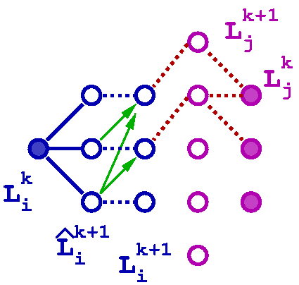

************
Adapt Design
************

In the *adapt phase*, blocks may refine or coarsen to adapt to the
evolving resolution requirements of a simulation.  The main
complication is enforcing the "level-jump" condition, which prohibits
adjacent blocks from being in non-consecutive mesh refinement levels.
Since we also want to only refine or coarsen a given block at most
once per refinement, we also have the "temporal" level-jump condition,
which prohibits a block's level from changing more than one level per
timestep.  These conditions are discussed in more detail below
in `Revised adapt algorithm implementation`_.

Maintaining the level-jump conditions may require refining blocks that
would not otherwise be refined, and may similarly require not
coarsening blocks that would otherwise be coarsened.  The process of
refining blocks in a mesh hierarchy to solely maintain the level-jump
condition across all block faces of interest is called *balancing* the
mesh.

Figure 1. illustrates the steps used in the adapt phase.  Suppose we
begin with the mesh hierarchy at the left, which contains seven
blocks: three in a coarse level and four in the next finer level.  The
first step involves applying local refinement criteria to each block;
in this particular example, only the center-most fine block is tagged
for refinement, here indicated by a "+" in the left-most image.

.. figure:: adapt-balance.png

   **Figure 1.** Refining a block (left) may trigger further refinmentes
   (center) to maintain the level-jump condition.

If we were to only refine this block, however, level jumps would be
introduced across the faces marked by red lines in the center image.
(Here we optionally include corners as "faces"; whether to include
corners---or edges in 3D---can be controlled using the ``Adapt :
min_face_rank`` input parameter).  The final mesh after completing
the balancing step is shown on the right.

We note that blocks marked for refinement solely to maintain the
level-jump condition may themselves trigger further refinement in
neighboring blocks.  While this cascade can repeat multiple steps,
blocks in each successive step are in a coarser level, so the cascade
is guaranteed to terminate.  However, this cascade still complicates
parallelizing the algorithm, since a given block may not immediately
know whether it needs to refine (or not coarsen) or not, so
determining when the balancing step of the adapt phase is actually
complete is non-trivial.

===================================
Revised adapt algorithm description
===================================

In this section we describe our "updated" algorithm for the adapt
phase in Enzo-E/Cello. The previous parallel algorithm relied on
Charm++'s support for **"quiescence detection"**, which is defines as
*"the state in which no processor is executing an entry point, no
messages are awaiting processing, and there are no messages
in-flight"* (see `The Charm++ Parallel Programming System
<https://charm.readthedocs.io/en/latest/charm++/manual.html#quiescence-detection>`_)
Getting the algorithm to work "correctly" required considerable effort
and debugging, and even after several years of development on Enzo-E /
Cello, users still occasionally ran into issues of level-jumps in the
resulting mesh hierarchy, which catestrophically stop simulations with
an error message.

Our revised algorithm avoids using quiescence detection in favor of a
more direct approach.  First, as with the previous algorithm, each
block evaluates its local adapt criteria to determine whether it needs
to refine, stay in the same level, or can coarsen.  Next, based on the
local adapt result and the current levels of its neighbors, each block
"commits to" its desired action if it has been decided; that is, if it
is guaranteed not to change during the balancing step.  Then, blocks
send to their neighbors their desired local adapt level, and whether
they are commited to that level or not. When a block then receives
updated status of its neighbors that forces either its next level or
its "committed" state to change, it again communicates that to its
neighbors. Each time a block transitions to the "commited" state, it
is counted, and when all blocks are counted, we know that all blocks
are now in the commited state, and consequently the balancing step is
complete.  Lastly, the actual coarsening and refinement of blocks
occur, after which the chare array of blocks is marked as "done" with
inserting and deleting, and the simulation progresses to the next
phase after adapt.

In this description there are some details that have been simplified,
and some potential issues that have not been identified.  Some of
these include the following:

1. Messages between neighboring blocks containing their updated levels
   are not guaranteed to be delivered in the order they were sent.
2. Communication can be reduced, since not all blocks need to
   communicate with all of their neighbors when sharing their
   refinement level and committed statuses.
3. Maintaining the global counter of committed blocks should be done
   in a way to reduce network contention, e.g. so that no single
   chare is bombarded with millions of requests to update its
   counter.

======================================
Revised adapt algorithm implementation
======================================

Below we summarize the updated algorithm used to perform the mesh
adaptation phase in Enzo-E/Cello.  First, some notation:

* :math:`B_i` *block i*
* :math:`B_j` *a block adjacent to block i*
* :math:`L_i^{k}` *the level of Block i in cycle k*
* :math:`\hat{L}_i^{k+1}` *Block i's desired next level (locally-evaluated)*
* :math:`\underline{L}_i^{k+1},\bar{L}_i^{k+1}` *Lower and upper bounds on the block's next level*
* :math:`L_i^{k,r}` *the value of the r'th step in updating the desired next level (consensus in progress)*
* :math:`L_i^{k+1}` *the final next level (committed: consensus completed)*
* :math:`\mathcal{C}` *set of all committed blocks*
 
Below we list some properties in terms of these values:

* :math:`|L_i^{k+1} - L_j^{k+1}| \le 1` *The  (spacial) level-jump condition*
* :math:`|L_i^k - L_i^{k+1}| \le 1` *The temporal level-jump condition*
* :math:`(\hat{L}_i^{k+1} =L_i^{k} + 1) \implies L_i^{k+1} = L_i^k+1` *Blocks that want to refine can always refine*
* :math:`(\hat{L}_i^{k+1} =L_i^{k}) \land (\forall_j L_j^k \leq L_i^k) \implies L_i^{k+1} = L_i^{k}` *Blocks that want to stay in the same level can if no neighboring blocks are in a finer level*

   **Figure 2.** Valid transitions between block levels

