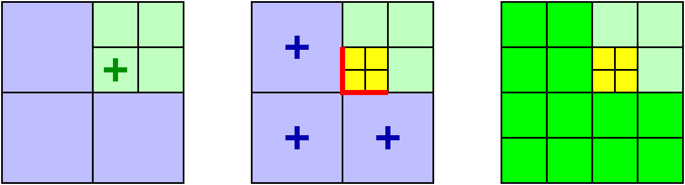

************
Adapt Design
************

In the *adapt phase*, blocks may refine or coarsen to adapt to the
evolving resolution requirements of a simulation.  The main
complication is enforcing the "level-jump" condition, which prohibits
adjacent blocks from being in non-consecutive mesh refinement levels.
(Blocks are partitioned into "levels" based on how refined they are:
more highly-refined blocks are in higher-numbered levels, with the
"root-level" of the simulation defined as "level 0".  The difference
in resolution between any pair of successive levels L and L+1 (the
"refinement factor") is always 2 in Enzo-E.)

Maintaining the level-jump conditions may require refining blocks that
would not otherwise be refined, or may require not coarsening blocks
that would otherwise be coarsened.  The process of refining blocks in
a mesh hierarchy solely to maintain the level-jump condition across
block faces is called *balancing* the mesh (not to be confused with
*dynamic load balancing*)

Figure 1. illustrates the steps used in the adapt phase.  Suppose we
begin with the mesh hierarchy at the left, which contains seven
blocks: three in a coarse level and four in the next finer level.  The
first step involves applying local refinement criteria to each block;
in this particular example, the center-most fine block is tagged for
refinement, here indicated by a "+" in the left-most image.

   **Figure 1.** Refining a block (left) may trigger further
   refinements (center) to maintain the level-jump condition.

If we were to only refine this block, however, level jumps would be
introduced across the faces marked by red lines in the center image
(here we optionally include corners as "faces").  By refining the
coarse blocks, these level jumps are removed. This final mesh after
completing the balancing step is shown on the right.

We note that blocks marked for refinement solely to maintain the
level-jump condition may themselves trigger further refinement in
neighboring blocks.  While such cascades can repeat multiple steps,
each block in the cascade is in a coarser level than its predicessor,
so cascades are always guaranteed to terminate.  However, cascades
still complicate parallelizing the algorithm, since any given block
may not immediately know whether it needs to refine (or not coarsen)
so determining when the balancing step of the adapt phase is actually
complete is non-trivial.

===================================
Revised adapt algorithm description
===================================

In this section we describe a revised algorithm for the adapt phase in
Enzo-E/Cello. This algorithm was first developed by Phil Miller, and
is presented in his Ph.D. Dissertation, `Reducing synchronization in
distributed parallel programs <\http://hdl.handle.net/2142/95305>`_
(University of Illinois at Urbana-Champaign, 2016).

The previous parallel algorithm implemented in Cello relied on
Charm++'s support for *"quiescence detection"*, which is defined as
*"the state in which no processor is executing an entry point, no
messages are awaiting processing, and there are no messages
in-flight"* (see `The Charm++ Parallel Programming System
<https://charm.readthedocs.io/en/latest/charm++/manual.html#quiescence-detection>`_)
Getting this algorithm to work correctly required considerable effort
and debugging, and even after several years of development on Enzo-E /
Cello, users still occasionally ran into issues of level-jumps in the
resulting mesh hierarchy.

Miller's algorithm avoids using quiescence detection in favor of a
more direct approach.  First, each block evaluates its local adapt
criteria to determine whether it needs to refine, stay in the same
level, or can coarsen.  Next, both lower and upper bounds on mesh
levels are determined for each block and communicated with neighbors.
Bounds for a block may be adjusted as newer updated bounds arrive from
neighboring blocks.  When a block's minimum and maximum levels match,
the block's next level is decided.  All leaf blocks are guaranteed to
reach this state, which can be proven by induction on the mesh level
starting with the finest level (See Miller 2016).

Before presenting the algorithm, we define the following notation:

* :math:`B_i` *block i*
* :math:`B_j` *a block adjacent to block i*
* :math:`L_i^{k}` *the level of Block i in cycle k*
* :math:`\hat{L}_i^{k+1}` *block i's desired next level as locally-evaluated from refinement criteria*
* :math:`\underline{L}_{i,s}^{k+1} \leq L_i^{k+1} \leq
  \bar{L}_{i,s}^{k+1}`: *current lower and upper level bounds (for
  step s), which are dynamically updated*
* :math:`L_i^{k+1}` *the next level which is decided when* :math:`\underline{L}_{i,s}^{k+1} = \bar{L}_{i,s}^{k+1}`
 
We can now write the two main conditions that we use to initialize and
update the level bounds:

* :math:`|L_i^k - L_i^{k+1}| \le 1` *the (temporal) level-jump condition: a block can refine or coarsen at most once per adapt cycle*
* :math:`|L_i^{k} - L_j^{k}| \le 1` *the  (spacial) level-jump condition: refinement levels of adjacent blocks can differ by at most one*

Level bounds are initialized to be :math:`\underline{L}_{i,0}^{k+1}
\leftarrow \hat{L}_i^{k+1}` and :math:`\bar{L}_{i,0}^{k+1} \leftarrow
L_i^{k} + 1`. That is, the minimum level is initially the level
determined by the local refinement criteria, and the maximum level is
initially one level of refinement more than the current level (or the
maximum allowed level in the simulation.)

The balancing step of the algorithm proceeds by alternately sending a
block's level bounds to its neighbors, and, having received updated
bounds from its neighbors, updating the block's own level bounds. Bounds are updated
according to the following:

:math:`\underline{L}_{i,s+1}^{k+1} \leftarrow \max ( \underline{L}_{i,s}^{k+1}, \max_j (\underline{L}_{j,s}^{k+1} - 1))`

:math:`\bar{L}_{i,s+1}^{k+1} \leftarrow \max ( \underline{L}_{i,s}^{k+1}, \max_j(\bar{L}_{j,s}^{k+1} - 1))`

The lower bound is updated if any neighbor's minimum bound is
greater than one plus the block's current minimum bound.  The maximum
bound, which is used to determine when the balancing algorithm
terminates, is defined as the maximum of the minimum bound, and the
maximum of `all` neighboring maximum bounds minus one. Note that in
general the maximum bound can only be updated after all neighboring
blocks have been heard from. Additional synchronization is required
for a block to coarsen, since a block can coarsen only if all of its siblings
can as well.

======================================
Revised adapt algorithm implementation
======================================

To reduce the complexity of the already over-burdened Block classes,
we introduce an ``Adapt`` class to maintain and update level bounds
for a Block and its neighbors. The ``Adapt`` class keeps track of the
current level bounds of all neighboring blocks, which is redundantly
stored as a list of ``LevelInfo`` objects for each neighboring Block,
and a ``face_level_`` vector of the current level in the direction of
each face. (The `face_level_` representation is a carry-over from the
previous algorithm, but was retained because it simplifies code that
needs to access a neighbor's level given the neighbor's relative
direction rather than absolute Index). Below summarizes the API for
the newer ``LevelInfo`` section, which is used to collectively
determine the next level for all blocks in the mesh.

``void set_rank (int rank)``

   Set dimensionality of the problem :math:`1 \leq \mbox{rank} \leq
   3`. Only required for initialization in test code, since Cello
   initializes it using `cello::rank()`.

``void set_valid (bool valid)``

   Set whether the Adapt object is "valid" or not. Set to false when
   the corresponding Block is refined. "valid" is accessed internally
   when a block is coarsened to identify the first call triggered by
   child blocks. It's set to true internally after the first call to
   coarsen().

``void set_periodicity (int period[3])``

   Set the periodicity of the domain, so that the correct neighbors
   can be identified on domain boundaries.

``void set_max_level (int max_level)``

   Set the maximum allowed mesh refinement level for the problem.

``void set_min_level (int min_level)``

   Set the minimum allowed mesh refinement level for the problem.

``void set_index (Index index)``

   Set the index of the Adapt object's associated block.

``void insert_neighbor (Index index)``

   Insert the given Index into the list of neighbors. This is a
   lower-level routine and should generally not be called--use
   ``refine_neighbor()`` instead.

``void insert_neighbor (Index index, bool is_sibling)``

   Insert the given Index, and specify that the Block is a
   sibling. This version is used exclusively in test code in
   test_Adapt.cpp.

``void delete_neighbor (Index index)``

   Delete the specified neighbor. This is a lower-level routine and
   should generally not be called--use ``coarsen_neighbor()`` instead.

``void reset_bounds ()``

   Reset level bounds for this block and neighbor blocks in
   preparation for a new adapt phase.

``void refine_neighbor (Index index)``

   Update the list of neighboring blocks associated with refining
   the specified neighbor block.

``void coarsen_neighbor (Index index)``

   Update the list of neighboring blocks associated with coarsening
   the specified neighbor block.

``void refine(Adapt adapt_parent, int ic3[3])``

   Update the Adapt object for a recently refined block. The block's parent
   adapt object is passed in to update the neighbor lists accordingly,
   and which child this block is in its parent block is specified by
   ic3[].

``void coarsen(Adapt adapt_child)``

   Update the adapt object for a recently coarsened block. Must be
   called exactly once for each coarsened child (in any order),
   specified by the child block's associated Adapt object.  This is
   required to update the neighbor lists correctly.

``void initialize_self(Index index, int level_min, int level_now)``

   Initialize the adapt object with the given Block index and level
   bounds.

``void update_neighbor(Index index, int level_min, int level_max, bool can_coarsen)``

   Update the specified neighbor block's level bounds and "can_coarsen"
   attribute.

``void update_bounds()``

   Reevaluate the block's level bounds given the current level bounds of
   all neighbors.

``bool is_converged()``

   Return whether the level bounds of this block have converged to a
   single value (that is min_level == max_level).

``bool neighbors_converged()``

   Return whether all neighboring block's level bounds have converged.

``void get_level_bounds(int * level_min, int * level_max, bool * can_coarsen)``

   Get the current level bounds and "can_coarsen" attribute for this
   Block. Must be preceeded by a call to "update_bounds()".

``bool get_neighbor_level_bounds(Index index, int * level_min, int * level_max, bool * can_coarsen)``

   Return the level bounds and "can_coarsen" attribute for the specified neighbor.

``int level_min()``

   Return the current lower bound on this block's refinement level.

``int level_max()``

   Return the current upper bound on this block's refinement level.

``bool can_coarsen()``

   Return the current value of "can_coarsen" for this block.

``int num_neighbors()``

   Return the number of neighbors for this block.

``int is_sibling(int i)``

   Return whether the ith neighbor is a sibling of this block (whether
   the neighbor block and this block share the same parent.

``Index index()``

   Return the Block index associated with this Adapt object.

``Index index(i)``

   Return the Block index for the ith neighbor block.
