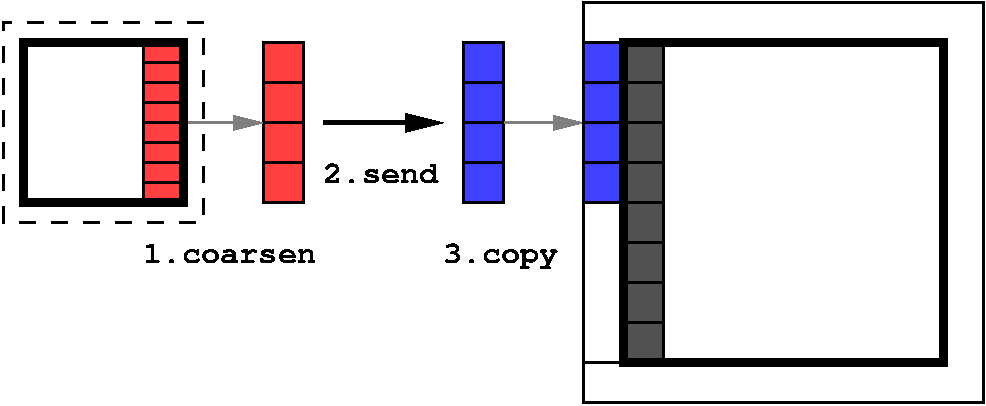
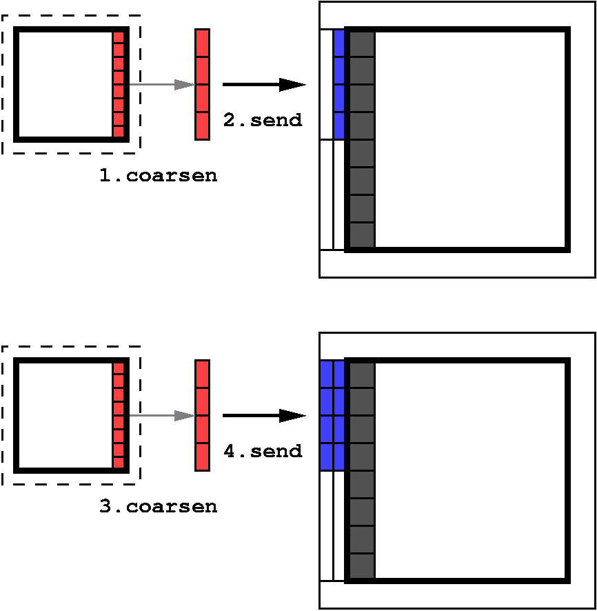

.. include:: ../roles.incl
  
***********************************
Flux Correction Design [INCOMPLETE]
***********************************
.. toctree::
     
============
Requirements
============

Flux correction involves updating field values along faces between
neighboring blocks to ensure that conserved quantities are indeed
conserved.  This correction step isn't required at all block faces: if
both mesh refinement levels and time steps are the same between two
adjacent blocks, then fluxes along the interfaces are expected to
already match to machine precision.  However, if neighboring blocks
have different spacial or temporal resolution, the computed solution
will not in general be conservative, so some type of correction due to
the inconsistent fluxes will be required.

.. note:: We use the term "resolution jump" to include a difference in
          *time steps* as well as in mesh resolution; similarly, we
          use "coarse" and "fine" to include relatively long and short
          time steps as well as relativly large and small block cell
          widths.

The basic update involves adding correction factors to all coarse
values that lie along coarse-fine interfaces, where the correction
factor is computed using the coarse and fine fluxes across the
interface.  While the basic update is straightforward, care must be
taken to ensure that the correction factors are computed correctly,
especially for non-centered field variables or when adaptive
time stepping is used.  Additional corrections will be required for
MHD, and expansion terms in cosmological problems may also need to be
considered.

Basic operations involved include the following:
   
#. allocating and deallocating flux data
#. setting and accessing flux values
#. communicating fluxes between neighboring blocks (fine-to-coarse)
#. computing correction factors given coarse and fine fluxes
#. correcting coarse-level field values given correction factors

Relative to ENZO's structured AMR grids, flux correction for Enzo-E /
Cello is simpler due to Cello's array-of-octree refinement: blocks
only share fluxes at block faces (Enzo-E blocks do not contain
sub-blocks), and the topology of fine- and coarse-level block
intersections is simpler (Enzo-E coarse-level block faces are adjacent
to exactly four fine-level block faces).  The first simplification
removes the need to loop over sub-grids or store fluxes internal to a
block (i.e. the "projection step" in ENZO), and the second removes the
need to explicitly store loop indices for flux arrays.

We assume fluxes for all conserved fields are provided by the
hydrodynamics solver along all required block faces at each time step.

.. note:: As this is a working document, specific requirements are
          expected to be added, modified, or shifted between layers as
          needed.
   
     
Method requirements
===================

The Method component is responsible for storing, accessing,
communicating, and operating with fluxes, to implement flux correction
using support provided by Cello flux classes.  Specific requirements
are listed below:

- **RE-1.** Initialize and store fluxes, provided by the hydro solver,
  at each time step for all conserved fields across all coarse-fine
  interfaces
- **RE-2.** Request required fluxes from neighboring Blocks
- **RE-3.** Compute correction factors for all required conserved
  field face values given a block face and fluxes from both the block
  and its face-sharing neighbor
- **RE-4.** Correct conserved field face values given computed
  correction factors
- **RE-5.** Identify which fields require flux correction
- **RE-6.** Support adaptive time stepping
- **RE-7.** Support MHD
- **RE-8.** Ensure conservation is not lost through any other operation, e.g. interpolation

Flux Classes requirements
=========================

Cello's flux classes primary responsibilities are to provide the
flux-correction method with sufficient support for storing fluxes,
computing flux correction factors, and applying the flux correction to
conserved field values.  Technical details, especially those involving
parallel computing and data communication, should be isolated from the
Enzo-E software layer as much as possible.

Specific requirements include the following:
   
- **RC-1.** Store fluxes of conserved fields that lie along block faces
- **RC-2.** Store associated fluxes computed on adjacent blocks
- **RC-3.** Communicate fluxes between adjacent blocks when (and ideally only when) needed
- **RC-4.** Store the time interval along with each collection of fluxes
- **RC-5.** Allow multiple fluxes to be stored for the same field but
  different time steps
- **RC-6.** Provide support for a block to compute correction factors
  along a block face given the block's fluxes and the corresponding
  neighboring block fluxes
- **RC-7.** Provide support for correcting field values along a block
  face given the computed correction factors
- **RC-8.** Allow for dynamic allocation and deallocation of fluxes (optional)
- **RC-9.** Ensure conservative inter-grid interpolation and coarsening

======
Design
======

Our design is developed top-down, starting with a Cello Method for
implementing flux correction, *MethodFluxCorrect*.
Using a Cello Method to implement flux correction is a natural
approach, since Methods are analagous to steps in the
high-level :p:`EvolveLevel()` function in ENZO, and flux correction is
one such step.  (Specifically, flux correction is performed in
ENZO---along with communication and a projection substep---in
:p:`UpdateFromFinerGrids()`, which is called by :p:`EvolveLevel()`).

To support coding :p:`MethodFluxCorrect`, our design introduces a
Cello class *FluxData*, whose responsibility is to collect together
all flux data required for flux correction on a block into a single
object.  This :p:`FluxData` class will be analagous to the existing
:p:`FieldData` and :p:`ParticleData` classes, which contain all field
data and particle data associated with a Block.  Like :p:`FieldData`
and :p:`ParticleData` objects, :p:`FluxData` will be contained in the
Blocks :p:`Data` object.  Communication will be handled by the refresh
mechanism by augmenting the existing communication of field and
particle data between Blocks to include communicating fluxes.

While flux data could be implemented directly as arrays
(e.g. std::vector, :p:`EnzoArray`, etc.) other attributes need to be
associated with each collection of flux data, specifically the Block
the fluxes were computed on, which Block face the fluxes are
associated with, the time interval for the fluxes, etc.  Thus, we
introduce a lower-level class *FaceFluxes* to store the array of flux
data for an individual face, along with its defining attributes.

Interfaces
==========

We develop the interfaces for the flux-related classes below, starting
with the top-level :p:`MethodFluxCorrect`, then the progressively
higher-level :p:`Face`, :p:`FaceFluxes`, and :p:`FluxData` classes.

---------------------------
MethodFluxCorrect class
---------------------------

The :p:`MethodFluxCorrect` class is a Cello :p:`Method`, whose
main virtual method is :p:`compute(Block)`.  This operates on some
subset of Fields and Particle types on a Block, and will include new
operations on fluxes as well.  The :p:`MethodFluxCorrect` method
communicates fluxes between neighboring blocks to ensure consistency
between processes, and computes and applies appropriate
flux-correction operations to required Fields values along block
interfaces.

Since the :p:`MethodFluxCorrect` class is inherited from the Cello
:p:`Method` class, the public interface for this class is already
prescribed.  The two methods in the interface are the constructor
:p:`MethodFluxCorrect()` used to initialize the required
communication, and :p:`MethodFluxCorrect::compute(Block)` which
implements flux correction on a given Block.  (The other virtual
function in the :p:`Method` interface is :p:`timestep()`, which is not
required for flux-correction.)

----

.. glossary::

   ``MethodFluxCorrect()``
   
      *Create a new MethodFluxCorrect object, and define its refresh communication requirements*
  
----

.. glossary::

   ``virtual void compute (Block * block)``
   
      *Request Cello to refresh its flux data, then apply flux correction*

      * **block**: *Block that flux correction is being applied to*
   
----

Below is prototype code for various steps of flux-correction needed,
including initializing for the communication step to refresh fluxes
between adjacent blocks, performing the refresh communication, and
performing the flux correction given the refreshed fluxes.

register fluxes refresh
-----------------------

While most Methods require Field and/or Particle data to be consistent
between neighboring blocks, the flux correction step requires fluxes
to be consistent.  Refresh phases in Methods are typically registered
in the Method's constructor, so we register a refresh phase with all
:p:`FluxData` block data in :p:`MethodFluxCorrect()`.  Although
code will need to be updated in the Cello layer to support refreshing
flux data between blocks, the prototype code below should be
relatively complete.

.. code-block:: C++

   MethodFluxCorrect::MethodFluxCorrect()
   {
      // Register a refresh phase to update fluxes
      
      ir_flux_ = add_new_refresh_();
      Refresh & refresh = new_refresh(ir_flux_);
      refresh.add_all_fluxes ();

      refresh.set_callback(CkIndex_EnzoBlock::p_method_flux_correct());
   }
   

perform fluxes refresh
----------------------

Performing the communication step to refresh fluxes between adjacent
blocks is analagous to similar code in other Enzo-E / Cello Methods
used to refresh field and particle data along faces.  Again, while
code will need to be updated in the Cello layer to support refreshing
flux data between blocks, the prototype code below should be
relatively complete.

.. code-block:: C++

   void MethodFluxCorrect::compute(Block * block)
   {
   
      // Start refresh phase to update fluxes
      
      block->new_refresh(ir_flux_).set_active(is_finest_(block));

      block->new_refresh_start
           (ir_flux_, CkIndex_EnzoBlock::p_method_flux_correct());
   }                           

   void EnzoBlock::p_method_flux_correct()
   {  static_cast<MethodFluxCorrect*> (solver())->update_field_faces(this);   }  

   void MethodFluxCorrect::update_field_faces(Block* block) throw()
   {
       // continue with updated fluxes

       // ...
   }

perform flux correction
-----------------------

.. code-block:: C++

   // WARNING: USES OUTDATED FaceFluxes and FluxData API's
   
   void MethodFluxCorrect::update_field_faces(EnzoBlock* block) throw()
   {
       // Get this block's Field and FluxData objects

       Index index        = block->index();
       FluxData flux_data = block->data()->flux_data();
       
       // Loop over all fields in the "conservative" field group

       for (int index_field = ...) {

          // Loop over all faces of this block
          
          for (int axis=0; axis<rank; axis++) {
             for (int face=-1; face<=1; face+=2) {

                // get "coarse" fluxes
                   
                FaceFluxes fluxes_coarse = flux_data.face_fluxes
                    (index_field,axis,face,cycle_start,cycle_stop,
                    flux_type_mine);

                if (face_requires_correction_(block,axis,face)) {

                   // Loop over all adjacent fine-level faces
                   
                   for (std::pair child = ...) {

                      // Loop over fine-grid time steps

                      FaceFluxes fluxes_fine;
                      for (int cycle=cycle_begin; cycle<cycle_end; cycle++) {
                      
                         fluxes_fine += flux_data.face_fluxes
                            (index_field,axis,face,cycle_start,cycle_stop,
                             flux_type_neighbor,child);
                      }

                      // Compute and apply flux correction on a face

                      update_field_face_
                         (Block, index_field, axis,face,child,
                          fluxes_coarse,fluxes_fine);
                }
             }
          }
       }
   }

.. note:: When adaptive time stepping is used, multiple time intervals
          of "fine-grid" fluxes will be required for a given face.  To
          avoid issues with comparing floating-point values, we assume
          an integer-valued "finest-grid" cycle number is available.
          However, until adaptive time stepping is implemented, this
          reverts to the block's current cycle for non-adaptive
          (constant over all blocks per cycle) time stepping.

.. code-block:: C++

   // WARNING: USES OUTDATED FaceFluxes and FluxData API's

   MethodFluxCorrect::update_field_face_
      (Block, index_field, axis,face,child,
       fluxes_coarse,fluxes_fine_sum);
   {
   
      // "attach" face_values to the Field's face (like subview of multiarray)
      
      FieldFace field_face = FieldFace(field,axis,face,child);

      int i_start[2],i_stop[2];
      fluxes_coarse.get_loop_limits(i_start,i_stop);
      
      for (int i1=i_start[1]; i1<i_stop[1]; i1++) {
         for (int i0=i_start[0]; i0<i_stop[0]; i0++) {

            // Apply flux correction at (i0,i1)

            field_face[i0][i1] += (fluxes_fine[i0][i1] - fluxes_coarse[i0][i1]);
         }
      }
   }

.. note:: The update is over-simplified, e.g. the field will have to
          be multiplied by density to get conservative form, fine-grid
          fluxes need to be weighted by relative volume, etc.

----------
Face class
----------

A :p:`Face` is defined as the intersection of two Blocks.  For flux
correction in hydrodynamics, it is sufficient for faces to be defined
by two Block indices where the Blocks share a (d-1)-dimensional face
(facet).  For MHD where area averages are used, the fluxes may
additionally be along a strict subset of a facet, and can be specified
using an integer tuple :p:`(fx,fy,fz)` where :p:`-1 <= fx,fy,fz <= 1`.  The
default :p:`(fx,fy,fz) == (0,0,0)` represents the entire face.

The Block indices are ordered, with the first defining on which Block
the fluxes were computed.  For flux correction, both
:p:`face(index_block, index_neighbor)` and :p:`face (index_neighbor,
index_block)` fluxes are required for flux correction on the coarser
Block.

----

.. glossary::

   ``Face::Face (Index index_block, Index index_neighbor, int fx=0, int fy=0, int fz=0);``
    *Create a Face object at the interface between two Blocks and     associated with the first Block.  Face must have rank d-1.  A "face     of a Face" is defined using integer tuple (fx,fy,fz) where -1 <=     fx,fy,fz <= 1.  The default (fx,fy,fz) = (0,0,0) reverts to the     entire face.*

----

.. glossary::

   ``bool Face::operator == (Face f1, Face f2) const;``
    *Compare   whether two faces are equal.  Note that face(f1,f2) == face(f2,f1),   since the face itself is defined by the unordered pair (f1,f2)--the   ordering only indicates on which Block the corresponding face is   associated with.*

----

.. glossary::

   ``int Face::index_block () const;``
    *Return the index of the Block for which the face is associated.*

----

.. glossary::

   ``int Face::index_neighbor() const;``
    *Return the corresponding neighbor Block index.*

----

.. glossary::

   ``void Face::get_subface (int *fx, int *fy, int *fz);``
    *Return the tuple (fx,fy,fz) identifying a subface of the intersection between two Blocks.  Default is (fx,fy,fz) = (0,0,0)*

----

.. glossary::

   ``bool Face::is_facet() const;``
    *Return whether the intersection between Blocks is a facet, that is     has rank d-1.  Must be true to be a valid face for flux correction.     WARNING: ignores domain boundary and boundary conditions.  Needs     domain array size and whether axis othogonal to the shared face is     periodic or not.*

----------------     
FaceFluxes class
----------------     

Face fluxes represent an array of fluxes of a conserved Field through
a Block's face or subset of a face.  Components of :p:`FaceFluxes` are
the following:

  * **face**: *The intersection between two Blocks for hydrodynamics;             for MHD, axis and direction may also be provided to             represent a "face within a face".  Defined using a pair             of Block indices, the first of which is the "owner" of             the fluxes.  See the :p:`Face` class discussion for more             details.*

  * **field**: *Field for which the fluxes are associated*

  * **dimensions**: *The dimensions defines how the face is discretized                   in space into surface elements.  This is :p:`(nx,ny,nz)` where one (or more) of :p:`nx,ny,nz`, equals 1.  If ghost zones are required for                   fluxes, a corresponding :p:`(gx,gy,gz)` is                   added, where the same one (or more) of :p:`gx,gy,gz` equals 0.  For non-centered zones, a                   centering offset may be needed :p:`(cx,cy,cz)`                   where one or more of :p:`cx,cy,cz` = 1 and                   others are 0.*

  * **volume**: *Physical size :p:`(hx,hy,hz,dt)` defining the               volume or area element and time step through which the               flux is moving.  One (or more) of :p:`h[xyz] = 1.0`,               corresponding to :p:`n[xyz] = 1`.  Note unused :p:`h[xyz]`               are 1.0 not 0.0 so that spatial area can be computed as               :p:`hx*hy*hz`.*

  * **fluxes**: *Floating-point array of fluxes.  Array size is               determined by :p:`(nx,ny,nz)` + :p:`2*(gx,gy,gz)` +               :p:`(cx,cy,cz)`.  May be extended precision to mitigate               effects of floating-point cancellation when subtracting               fluxes, though ideally should use extended precision               when computing them in the first place.*

----

.. glossary::

   ``void FaceFluxes::FaceFluxes (Face face, int index_field, int nx, int ny, int nz, double hx, double hy, double hz, double dt);``
     *Create a FaceFluxes object for the given face, field, and time     interval.*

----

.. glossary::

   ``void FaceFluxes::set_ghost(int gx, int gy, int gz);``
     *Set ghost zones if any.*

----

.. glossary::

   ``void FaceFluxes::set_centering(int cx, int cy, int cz);``
     *Set centering if non-centered.*

----

.. glossary::

   ``void FaceFluxes::allocate ();``
     *Allocate the flux array.*

----

.. glossary::

   ``void FaceFluxes::deallocate();``
     *Deallocate the flux array.*

----

.. glossary::

   ``Face FaceFluxes::face () const;``
     *Return the face associated with the FaceFluxes.*

----

.. glossary::

   ``void FaceFluxes::get_element_size (double *hx, double *hy, double * hz) const;``
     *Return the volume size of the fluxes.  May differ from Block cell     width if coarsening operations have been performed.*

----

.. glossary::

   ``double FaceFluxes::time_step () const;``
     *Return the time step dt of the accumulated fluxes.  May differ from      Block time step if multiple time steps have been accumulated.*

----

.. glossary::

   ``void FaceFluxes::get_dimensions (int *mx, int *my, int *mz) const;``
     *Return the array dimensions, including adjustments for ghost or      centering.  One or more of mx,my,mz will be 1.*

----

.. glossary::

   ``void FaceFluxes::set_fluxes ( T * array, int dx, int dy, int dz);``
     *Copy flux values from an array to the FluxFaces.  Array element     array[ix*dx + iy*dy + iz*dz] should correspond to flux value     (ix,iy,iz), where (0,0,0) <= (ix,iy,iz) < (mx,my,mz).*

----

.. glossary::

   ``T * FaceFluxes::get_fluxes (int * dx, int * dy, int *dz);``
     *Return the array of fluxes and associated strides (dx,dy,dz) such     that the (ix,iy,iz) flux value is fluxes[ix*dx + iy*dy + iz*dz],     where (0,0,0) <= (ix,iy,iz) < (mx,my,mz).*

----

.. glossary::

   ``friend float ratio_cell_width (FaceFluxes ff_1, FaceFluxes ff_2) const;``
     *Return the ratio of volume element resolutions h(ff_1) / h(ff_2) =     {0.5, 1.0, 2.0} along each dimension between stored fluxes in two     FaceFluxes objects.  FaceFluxes are assumed to be associated with     the same face.  Must be 1.0 to compute sum or difference.*

----

.. glossary::

   ``friend float ratio_time_step (FaceFluxes ff_1, FaceFluxes ff_2) const;``
     *Return the ratio of time steps dt(ff_1) / dt(ff_2) = {0.5, 1.0,      2.0} of fluxes between two FaceFluxes objects.  FaceFluxes are      assumed to be associated with the same face.  Ratio must be 1.0 to      compute difference.*

----

.. glossary::

   ``void FaceFluxes::coarsen ();``
      *Coarsen a FaceFluxes object by reducing dimensions by two along      each face dimension, and summing fine elements contained in each      coarse flux element.  Updates volume element resolution (hx,hy,hz)      accordingly.  Used for coarsening fine-level fluxes to match coarse      level fluxes.*

----

.. glossary::

   ``FaceFluxes & FaceFluxes::operator += (FaceFluxes face_flux);``
     *Add FaceFluxes object to this one. FaceFluxes are assumed to be      associated with the same face.  Used for accumulating fluxes with      finer time steps until they match the coarser time step.  Updates      dt accordingly.  Assumes spacially-conforming FaceFlux objects:      FaceFluxes must be associated with the same face, and ratio of      cell_widths must be 1.0*

----

.. glossary::

   ``FaceFluxes & FaceFluxes::operator *= (double weight);``
     *Scale the fluxes array by a scalar constant.*

----

.. glossary::

   ``friend FaceFluxes operator - (FaceFluxes ff_1, FaceFluxes ff_2);``
     *Return a FaceFluxes object containing the difference (ff_1 - ff_2)      between the two FaceFluxes.  Used to compute flux correction      factors.  Assumes fully-conforming FaceFlux objects: FaceFluxes must be      associated with the same face, and ratios of both cell_widths and      time_steps must be 1.0.*

        
   
--------------
FluxData class
--------------

The :p:`FluxData` class defines a collection of all :p:`FluxFaces` required
by a Block to perform flux corrections.  This includes all :p:`FluxFaces`
on :p:`Faces` whose neighboring Block differs either in either mesh
refinement or time step.  :p:`FluxFaces` are expected to come in pairs,
one corresponding to the Block, and one corresponding to the
neighboring Block.  FaceFluxes in the :p:`FluxData` object may be in a
non-conforming state, that is the volume elements may not match,
either spatial area or time step.  Coarsening and summing over
time steps of :p:`FluxData` objects are used to create fully-conforming
:p:`FluxFaces`, after which differencing is permitted for computing the
flux-correction factors.  Support for coarsening, adding, and
differencing fluxes is the responsibility of the :p:`FaceFluxes` class;
:p:`FluxData` is primarily a container.

.. glossary::      

   ``FluxData::FluxData()``
     *Create an empty FluxData() object*

----

.. glossary::      

   ``void FluxData::insert_fluxes(FaceFluxes * face_fluxes)``
    *Insert the given FaceFluxes object into the FluxData.  Must be   dynamically allocated, and responsibility for deleting face_fluxes   is transfered to the FluxData object.*

----

.. glossary::      

   ``void FluxData::remove_fluxes(FaceFluxes * face_fluxes)``
    *Remove the FaceFluxes object from the FluxData object, but do not    delete it.*

----

.. glossary::      

   ``void FluxData::delete_fluxes(FaceFluxes * face_fluxes)``
    *Remove the FaceFluxes object from the FluxData object and delete    it.*

----

.. glossary::      

   ``FaceFluxes FluxData::face_fluxes (Face face, Index index_block, int index_field)``
    *Return the FaceFluxes object for the given Face, Block index, and    Field index.  Block index must match one of defining Block indices    for Face.*

----

.. glossary::      

   ``int FluxData::num_face_fluxes()``
    *Return the number of FaceFluxes in the FluxData object.*

----

.. glossary::      

   ``FaceFluxes FluxData::face_fluxes (int i)``
    *Return the ith FaceFluxes object.*

Flux Communication
==================

Communicating fluxes between adjacent blocks is similar to communicating
field face data and migrating particles, so it makes sense to
augment the existing refresh mechanism for communicating :p:`FieldData`
and :p:`ParticleData` to also refresh :p:`FluxData`.  We briefly
outline a couple possible differences below.

First, flux data is generally only communicated from coarse blocks to
neighboring fine blocks, and from blocks with a smaller time step to
neighboring blocks with larger time steps.  Thus an additional
communication pattern and associated synchronization could be
introduced.  Examples of existing synchronization patterns are
:p:`sync_neighbor` type for communicating between all pairs of
adjacent leaf blocks, and :p:`sync_level` between all adjacent blocks in the
same level.  For fluxes, we could introduce a :p:`sync_fluxes` synchronization
type, which by definition includes

   1. leaf blocks only
   2. *usually* only d-1 faces (may need block edge- or
      corner-adjacent flux data for MHD)
   3. only from finer resolution to coarser resolution (temporal as
      well as spacial)

---- 

    Communicating fluxes assuming constant time steps.               
      
---- 

    Communicating fluxes assuming adaptive time steps.               
      
Testing
=======

In Enzo-E / Cello we strive to use test-driven development, which
helps keep development cycles short and helps keep the code base from
accumulating untested code.

We will include unit tests for the lower level :p:`FaceFluxes` and
:p:`FluxData` classes, and use application testing for
:p:`MethodFluxCorrect`.

Hydrodynamics application tests will include increasingly difficult
test problems, with the easiest being a 2D two-level AMR (L=2)
single-processor (P=1) single-cycle (C=1) problem.  This should be
simple enough to allow a debuggable problem, where the count of
flux-correction steps is finite.  A similar progression of
increasingly difficult problems will be used for MHD.  The "hardest"
problem should be many levels, many processes (multi-node at the
least) and long-duration.

Similar series of tests including self-gravity and cosmolgy will be
developed.

- **DT-1.** :p:`FaceFluxes` unit tests
- **DT-2.** :p:`FluxData` unit tests
- **DT-H.** Hydrodynamics application tests
- **DT-H1.** 2D L=2 P=1 C=1 hydro (easiest hydro)
- **DT-H2.** 3D L=2 P=1 C=1 hydro
- **DT-H3.** 3D L>2 P=1 C=1 hydro
- **DT-H4.** 3D L>2 P>1 C=1 hydro
- **DT-H5.** 3D L>2 P>1 C>1 hydro (hardest hydro)
- **DT-G.** Self-gravity application tests
- **DT-C.** Cosmology application tests

Documentation
=============

- **DD-1.** *Design*: add flux correction design to :p:`design/design-flux.rst` 
- **DD-2.** *Method*: add :p:`MethodFluxCorrect` method documentation to :p:`user/problem_method.rst`
- **DD-3.** *Testing*: add :p:`testing/testing_flux.rst` test documentation
   
==========
Milestones
==========

- **M-1.** :p:`MethodFluxCorrect` demonstrated  working for hydrodynamics
- **M-2.** :p:`MethodFluxCorrect` demonstrated  working for MHD

=====
Tasks
=====

- **T-1.** :p:`FaceFluxes` class design and implementation
- **T-2.** :p:`FluxData` class design and implementation
- **T-3.** :p:`MethodFluxCorrect` class design and implementation

=====
Notes
=====

Progress notes 2020-04-08
=========================

   A. **Data**: Flux-related data classes and unit tests (95%)

     - Face: 100% complete
     
     - FaceFluxes: 90% complete

       - TODO: get_limits () (compute loop limits of Block values for face)
       - TODO: operator += () (a few unit tests fail)

     - FluxData: 90% complete (unit tests)

   B. **Method**: Started implementing MethodFluxCorrect (50%)

     - sum conserved fields and compare with initial

       - quad-precision
       - main difficulty in writing application tests
       
   C. **Communication**: Started on flux-refresh (50%)
     
     - added FluxData object to Block's Data object
     - added support for refresh only across level jumps
     - incorporating FluxData in DataMsg (50%)

       - TODO: implement serializing and deserializing Flux data objects
       
   D. **Initialization**: Started on copying fluxes from PPM to FluxData (50%)

     - ENZO "fluxes" struct exists in Enzo-E
     - mainly copying ENZO flux-related code to Enzo-E
     - using old "M16" version of ENZO (Enzo-E uses "ppm_de" et al)
     - copying "fluxes" to FaceFluxes in FluxData is straightforward

   E. **Testing** (95%)

     - Unit tests almost done
       
       - just FluxData remaining
         
     - Application tests straightforward

       - summing conserved quantities is the "hard" part
       - just need to run different problems and monitor "conserved" quantities

   F. **Debugging** (???)

     - Initialization: run same problem in ENZO and Enzo-E and compare
     - Communication: check that what's sent is what's received
     - Method

       - application test results
       - compare same problem in ENZO and Enzo-E
         
       
