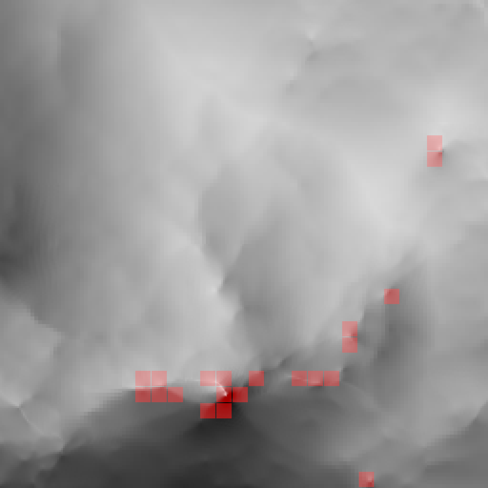
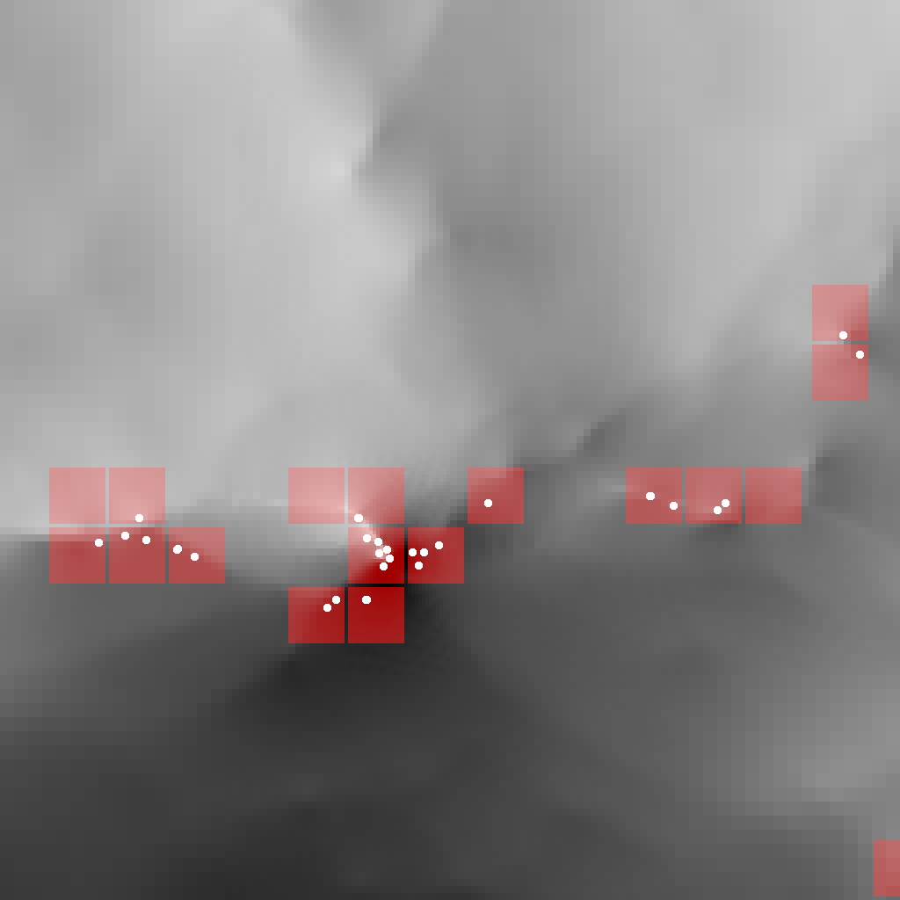
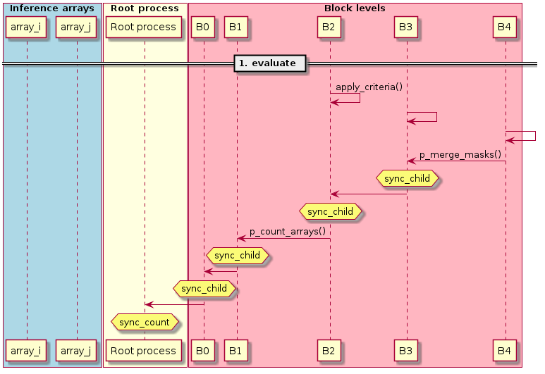
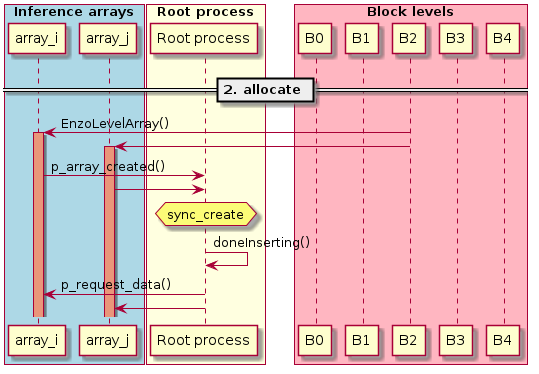
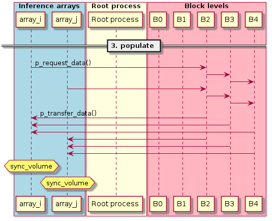
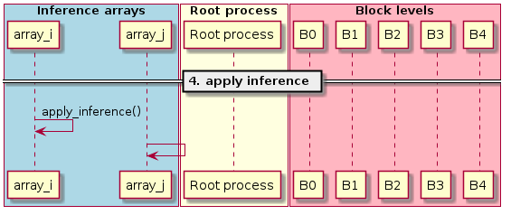
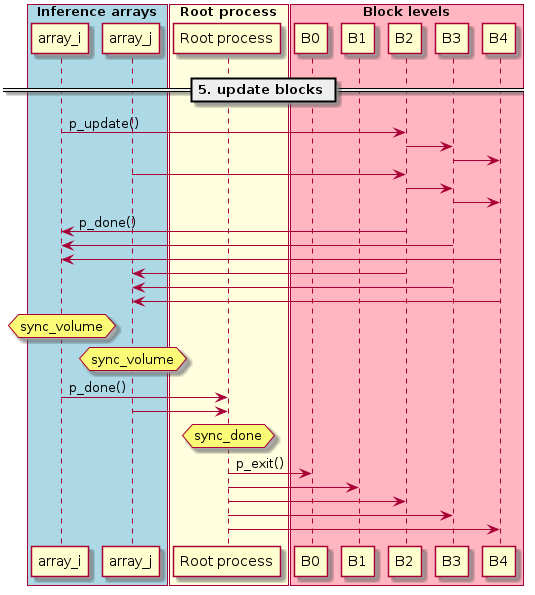

.. include:: ../roles.incl

.. _Inference Design:

**********************
Inference Array Design
**********************

.. toctree::

=======
Purpose
=======

This page describes the design of the ``EnzoMethodInference`` Method.
The purpose of this method is to create a collection of regular arrays
("inference arrays"), each containing a subset of block field data to
pass to an external Deep Learning (DL) inference method. After the
inference method is invoked, the intersecting leaf blocks are provided
with the pertinent output of the inference method, such as the
locations of bubbles where star formation is expected to occur. A
mock-up of inference arrays and generated bubbles is shown in the
above figures, with inference arrays indicated by squares in the left
figure, and bubble locations added in the right figure.

Some characteristics of inference arrays include the following:

   1. inference array sizes are typically about 64^3
   2. all inference arrays have the same size and resolution
   3. inference array positions are a regular 3D grid
   4. inference arrays are only created and allocated where needed

Where inference arrays are created is determined by some relatively
simple (local) criteria, such as density threshold, possibly coupled
with a restriction on the block's minimum refinement level. Field data
are then copied from intersecting leaf block fields to the inference
arrays, using either linear restriction or prolongation.

Some assumptions we make include the following:

   1. a given block may intersect multiple inference arrays
   2. a given inference array may intersect multiple blocks
   3. inference arrays are aligned with blocks in some specific AMR level, ``level_array``
   4. inference array resolution matches that of blocks in some (finer) AMR level, ``level_infer``.

Since inference arrays are aligned with blocks in a specific
refinement level, we use the term "level array" to refer to the sparse
array of inference-arrays. The level array is implemented as a sparse
3D Charm++ chare array, where each element of the chare array is a
collection of inference arrays containing field data for its region.

Some synchronization and performance issues that should be addressed
in the design include the following:

   1. multiple level array "create" requests may be received from intersecting leaf blocks, but the level array element can only be created once
   2. inference arrays tend to be clustered, so level array elements should be distributed across compute nodes to reduce compute and memory load imbalances
   3. level arrays elements won't know `a priori` the indices of intersecting leaf blocks, so that must be determined dynamically via tree traversal
   4. the Charm++ ``doneInserting()`` method must be called on the level chare array, but only after all elements are created, so synchronization is required

======
Phases
======

Phases of the algorithm include the following:

   1. **evaluate**: Blocks apply local criteria to determine where to create inference arrays
   2. **allocate**: The "level array" chare array of inference arrays is created
   3. **populate**: Inference arrays request and receive field data from intersecting leaf blocks
   4. **apply inference**: Inference arrays apply the external DL inference method
   5. **update blocks**: Inference arrays send results back to intersecting leaf blocks

These phases are described in more detail below:

Phase 1. Evaluate
=================

Below is a UML sequence diagram illustrating the evaluation phase in ``EnzoMethodInference``.  The left blue columns represent inference
arrays, the red right columns represent blocks in different refinement
levels, and the center yellow column represents the root-node
Simulation object, used for synchronization and counting.

In the "Evaluate" phase, Blocks apply local criteria to determine
where to create inference arrays.  Control enters the method at the
Block level, such that ``EnzoMethodInference::compute()`` is called on
all blocks, which in turn call ``apply_criteria()``.

The criteria currently implemented is whether the point-wise density
is greater than the block-local average by some specified threshold.
(See the :ref:`Inference Parameters<inference parameters>` section for
user parameters for the inference method, including density
threshold).

To improve performance, this is applied only on "sufficiently fine"
level blocks, specified by ``level_base`` (``level_base`` = 2 is
typical). Inference arrays are guaranteed not to intersect leaf blocks
in levels coarser than ``level_base``; conversely, all blocks (leaf or
non-leaf) in ``level`` = ``level_base`` that intersect inference arrays are
guaranteed to exist. This property is used for communication from the
level array to leaf blocks.

After a leaf block applies the criteria ``apply_criteria()``, if any
cells satisfy the criteria, the associated intersecting level array
elements are tagged for creation. Note there may be multiple such
elements, based on whether the block is coarser or finer than
``level_array`` (the level at which blocks and inference arrays
coincide). If there are multiple intersecting inference arrays for a
block, a logical "mask" array is used for keeping track of which
inference arrays to create. If only one inference array intersects a
leaf block, the mask size is 1.

These masks are merged toward the coarser ``level_base`` level, using
the ``p_merge_masks()`` entry method called on block parents. At each
step, the child masks are merged in their parent block using
logical-OR (if ``level >= level_array``) or concatenation (if ``level <
level_array``).

When ``level_base`` is reached (level 2 in the
figure), each block in the ``level_base`` level will have a mask
specifying where each inference array needs to be created. At this
step, the level array elements are created using
``p_create_level_array()``.

The reduction operation continues with counting the number of
inference arrays created, using ``p_count_arrays()``. This continues
down to the root level blocks, which send the accumulated counts to
the root Simulation object. After all root-level block counts have
been received, the Simulation object will contain the total number of
inference arrays to be created, which is used to initialize
synchronization counters.

Phase 2. Allocate
=================

The count of number of inference arrays to create, determined in the
previous phase, is used to determine when all level array elements
have been created.  (As a technicality, the count is set to one more
than the count to prevent the algorithm from hanging if no level array
elements need to be created, which is possible. If no inference arrays are
created, the method exits immediately).

As level array elements are created, the constructor notifies the root
Simulation object via ``p_level_array_created()``, which decrements
the counter.  When zero is reached, all level array elements are
guaranteed to have been created, and the Simulation object can then
finalize the chare array by calling the Charm++ "doneInserting()"
method, and proceed to the next phase.

Phase 3. Populate
=================

After the level array chare array is created, the root Simulation
object calls ``p_request_data()`` on all elements of the array. Each
level array element sends a request to the unique block in
``level_base`` that it intersects.  This request is then forwarded via
child blocks to all intersecting leaf Blocks using
``p_method_infer_request_data()``.

When an intersecting leaf Block is reached, it serializes the required
portion of field data and sends it directly to the intersecting inference array.
Blocks coarser than ``level_infer`` must interpolate the
data, which is done on the receive end; blocks finer than
``level_infer`` restrict data before sending it. The data is sent
directly to the requisting level array element using
``EnzoLevelArray::p_transfer_data()``.

Phase 4. Apply inference
========================

Level array elements keep track of incoming data, counting the relative volume of
incoming data until the relative volume reaches 1.0. After the last piece of data
is received and copied into the inference arrays, the level array element calls
``EnzoLevelArray::apply_inference()``. After the DL inference
method is applied, ``p_infer_done()`` is called on the root-level Simulation
object. The root Simulation object counts down the number of calls received,
so it knows when all DL inference methods have completed.

Phase 5. Update blocks
======================

After all DL inference methods have completed, level array elements
forward the results to the intersecting leaf blocks. This is done
using the same communication pattern as in the **populate** phase with
``p_request_data()``, in which data is sent to the unique
``level_base`` block and forwarded to the child leaf blocks via
intersecting child blocks.

For the method to end, all Blocks must call ``compute_done()``. To
ensure this is called only after all Blocks have been updated with
their data, a final ``p_results_received()`` call is forwarded from
leaf blocks down to base_level Blocks, which update the root
Simulation object. The root simulation object counts the
acknowledgements, and calls ``compute_done()`` on all Blocks when the
countdown is completed.
