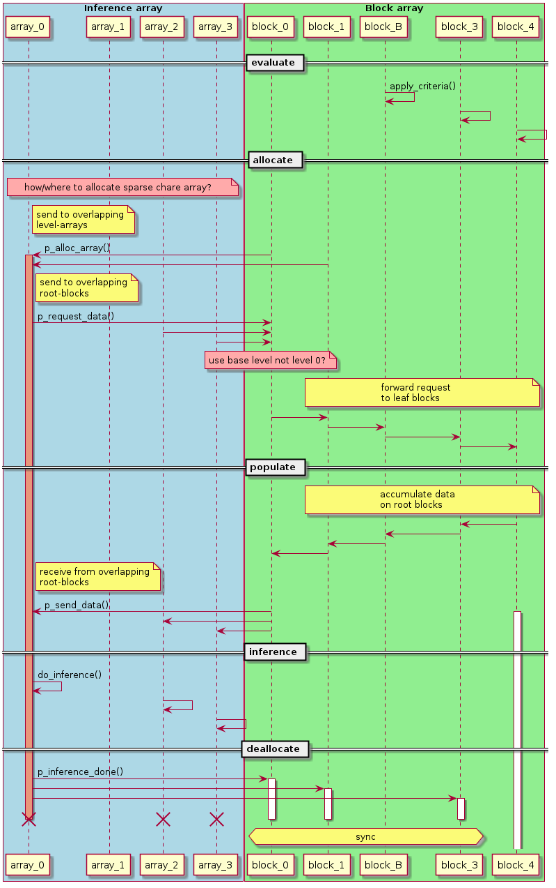

.. include:: ../roles.incl

**********************
Inference Array Design
**********************

.. toctree::

============
Requirements
============

========
Approach
========

======
Design
======

The purpose of the EnzoMethodInferenceArray method is to create arrays
of block field data to pass to an external machine learning inference
method, invoke the inference method, then update associated block data
based on the inference method results.

Some characteristics include:

   1. arrays are about 64^3
   2. arrays are associated with a specific non-negative refinement level
   3. arrays are only created where needed

Data must be copied from block fields to arrays, using either linear
restriction or prolongation, and back again. Inference arrays are
created based on some simple criteria, such as density threshold,
possibly coupled with a restriction on how coarse the block can be.

Some assumptions we make include:

   1. inference array edges are aligned with coarse-grid `cells` (but
      not necessarily coarse-level `blocks`)
   2. inference arrays may overlap each other using "ghost zones"
   3. A given block may overlap multiple inference arrays
   4. A given inference array may overlap multiple blocks

Since inference arrays are associated with a specific refinement
level, we will henceforth use the term "level array" to refer to the
array.

Some issues include the following:

   1. multiple level array "create" requests may be received from overlapping blocks
   2. distributing level arrays across the machine to prevent
      overflowing nodal memory
   3. level arrays won't a priori know in which levels overlapping
      blocks live
   4. synchronization between blocks and inference arrays will be needed
   5. level arrays will tend to be clustered, which can cause
      load imbalances

Phases of the algorithm include the following:

   1. Blocks apply criteria to determine which level arrays to create
   2. Create level arrays
   3. Level arrays request data from overlapping blocks
   4. Blocks pack and send data to level arrays
   5. Level arrays receive and unpack block data
   6. Level arrays call ML inference
   7. Level arrays send results to overlapping blocks
   8. Leaf Blocks process recevied data
      
These phases are described in more detail below:

1. Blocks apply criteria to determine which level arrays to create
==================================================================   

Control enters the Method at the Block level, in which all blocks call
``Method::compute()``. Blocks in negative levels will not be involved
in the Method, so can immediately call ``compute_done()``.

Initially we use the "Refine" capability used for mesh adaptation as
the criteria whether to create a given inference array. This criteria
may be combined with additional criteria, such as the Block must have
some minimum refinement level K.  Note that this does `not` mean all
blocks overlapping a given level array will have that minimum
refinement level, since not all overlapping blocks need to satisfy the
"create" criteria.

After a leaf block applies the criteria, if any cells satisfy the
criteria, the associated overlapped level arrays are tagged for
creation. While the easiest way to do this would be to send a message
directly to the level array element, that element will by definition
not exist until it is created. We instead send the request to the
ancestor block in the minimum-level array, which will collect
requests, and handle creating the level array.  Alternatively the
level-0 blocks could be used, but this will increase parallelism,
which may be an issue due to the tight clustering of level arrays.

Synchronization is required to determine when this phase is complete.
Since level-K blocks span the domain, we require all leaf blocks to
update the level-K block ancestor. The level-K block will update a
volume-based counter with each receive, and will synchronize with its
level-0 ancestor, which will count level-K receives. Level-0 blocks
will in turn synchronize with the root process. For small K and low
block counts, this multi-level synchronization may not be needed,
though in that case may as well set K=0.

2. Create level arrays
======================

Control after phase 1 is in the root-level Simulation object, which
needs to call ``doneInserting()`` to finalize the insertion of chare
elements. We may need some extra synchronization to ensure all
elements are actually created, since Block B calling
``LevelArray::ckNew()``, then calling
``EnzoSimulation::p_done_creating()``, does not ensure that
``ckNew()`` will actually be called before ``p_done_creating()`` is
called.  Synchronization may be required via the LevelArray
constructor.

After ``doneInserting()`` is called, we call the LevelArray elements
to request data from the blocks in the next phase.

3. Level arrays request data from overlapping blocks
====================================================

Control begins in ``LevelArray::p_request_data()``. A level array computes
its overlapping level-K blocks, and calls
``Block::p_request_level_array_data()`` to request block data. The level-K
blocks will forward requests to any overlapping child blocks. Note not
all child blocks may overlap the level array.

4. Blocks pack and send data to level arrays
============================================
      
Control begins in ``Block::p_request_level_array_data()`` in the leaf
blocks. These will pack all required field data and send it to the
LevelArray. Field data on a Block in level L > K will be restricted
(L-K) times before sending to the LevelArray. Blocks in level L < K
will send full data, which will be prolonged (K-L) times at the
receiving end. Note a given Block may overlap multiple Level Array
elements.

5. Level arrays receive and unpack block data
=============================================

Level Arrays will receive data from overlapping leaf blocks via
``LevelArray::p_receive_block_data()``.  Synchronization will be via a
volume-based counter or by counting updated overlapping cells.  When
all field arrays are updated, the next phase is invoked.

6. Level arrays call ML inference
=================================

After a Level Array has initialized all of its arrays from the
received Block data, it calls the external inference method, then
immediately calls the last phase.

7. Level arrays send results to overlapping blocks
==================================================

After the level array has been processed, data may need to be sent to
the overlapping Blocks. This is done by using a reverse process of the
receiving. Data will be sent to overlapping blocks, with 0-padding in
cells of overlapping Blocks that do not overlap the blocks. Data are
associated with fields, but not necessarily the same fields as those
sent from blocks to level arrays.

Synchronization is done by the receiving blocks counting the number of
receives until that count reaches the number of overlapping blocks.

8. Leaf Blocks process recevied data
====================================

Lastly, the leaf blocks self-update based on received data.

To finalize the Method, all (non-negative level) Blocks must call
``Block::compute_done()``. This is done starting at the leaf-level,
with each leaf block calling ``compute_done()`` after completing this
phase, then calling ``p_method_level_array_done()`` on its
parent. Non-leaf blocks will count receives until ``num_children()``
are reached, call ``compute_done()``, and call
``p_method_level_array_done()`` on its parent, if any.

