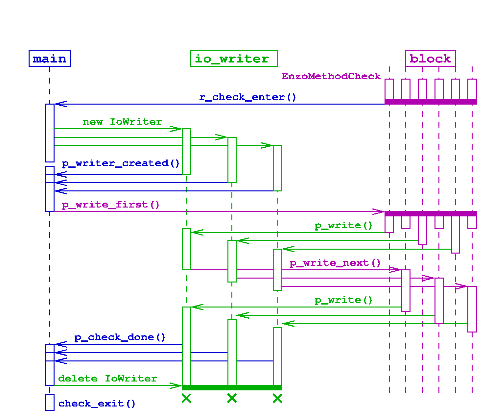

.. include:: ../roles.incl

*************************
Checkpoint/Restart Design
*************************

.. toctree::

============
Requirements
============

Three code functional requirements of I/O in Cello are:

  1. writing data dumps for subsequent reading by external
     analysis/visualization applications
  2. writing checkpoint files, and
  3. reading checkpoint files to restart a previously run simulation

(While writing image files such as "png" files is also included in the
I/O component of Cello, here we focus on HDF5 files containing
actual block data.)

Additionally, writing and reading disk files must be scalable to the
largest simulations runnable on the largest HPC platforms available,
which necessarily include the largest parallel file systems available.

This scalable I/O approach has been implemented for
checkpoint/restart, and will be adapted for use with data dumps in the
near future.

========
Approach
========

The approach used includes determining a block ordering to aid mapping
blocks to files, what data are written to the files, and how file I/O is
parallelized.

--------
Ordering
--------

The approach involves a generalization of the previous
``MethodOutput`` method, but enables load-balancing of data between
disk files through the use of block `orderings` to define how blocks
are mapped to files. Currently, the ordering used in ``MethodOutput``,
which is implicit and embedded in the code, is based on a regular
partitioning of root-level blocks together with their descendents. The
updated implementation factors out this ordering into an ``Ordering``
class, provides a Morton space-filling curve ordering, and allows
enables defining other orderings, such as Hilbert curves

------------
File content
------------

The content of the data files must be augmented to include all state
data required to recreate a previously saved AMR block array on
restart. Some information such as block connectivity are generated as
blocks are inserted into the mesh hierarchy. Other information such as
method or solver parameters are not stored, but are taken from
the parameter file. This allows for "tweaking" of parameters on
restart, for example to adjust refinement criteria or solver
convergence criteria.

------------
Control flow
------------

Control flow is handled by separate ``IoWriter`` or ``IoReader`` chare
arrays, where each element is associated with a single HDF5
file. Advantages over previous approaches are better load-balancing of
I/O operations, and decoupling of I/O operations from the Block chare
array. For Enzo-E checkpoint/restart data in particular,
``IoEnzoReader`` and ``IoEnzoWriter`` chare arrays are used.

======
Design
======

Components of the new I/O approach include

  1. Control management

     * ``control_restart.cpp``

        - ``Main::r_restart_enter()``
        - ``Main::p_restart_done()``
        - ``Main::restart_exit()``

  2. New Classes

     * ``EnzoMethodCheck``
     * ``IoEnzoReader``
        - ``IoEnzoReader::IoEnzoReader()``
     * ``IoEnzoWriter``
        - ``IoEnzoWriter::IoEnzoWriter()``
     * ``IoReader``
        - ``IoReader::IoReader()``
     * ``IoWriter``
        - ``IoWriter::IoWriter()``
     * ``MethodOrderMorton``

------------------
Output: checkpoint
------------------

--------------
Input: restart
--------------

The UML sequence diagram below shows how the ``Simulation`` group,
IoReader chare array, and Block chare array interoperate to read data
from a checkpoint directory. Time runs vertically starting from the top,
and the three Charm++ group/arrays are arranged into three columns.
Code for restart is found in the ``enzo_control_restart.cpp`` file.

startup
-------

Restart begins in the "startup" phase, with the unique root block for
the (0,0,0) octree in the array-of-octrees calling the ``Simulation``
entry method ``p_restart_enter()``.

The ``p_restart_enter()`` entry method reads the number of
restart files from the top-level `file-list`
file, initializes synchronization counters, and creates the
``IoEnzoReader`` chare array, one element for each file.

The ``IoEnzoReader`` constructors calld the ``p_io_reader_created()``
entry method in the root ``Simulation`` object to notify it that
they've been created.

``p_io_reader_created`` counts the number of calls, and after it
has received the last ``IoEnzoReader`` notification, it distributes the
``proxy_io_enzo_reader`` array proxy to all other ``Simulation`` objects by
calling ``p_set_io_reader()``.

``p_set_io_reader()`` stores the incoming proxy, then calls the
``r_restart_start()`` barrier across ``Simulation`` objects, which is
used to guarantee that all proxy elements will have been initialized
before any are accessed in subsequent phases.

level 0
-------

In the level-0 (root-level) phase, the root ``Simulation`` object
reads the file names from the `file-list` file, and calls the
``p_init_root()`` entry method in all ``IoEnzoReader`` objects,
sending the checkpoint directory and file names.

The ``p_init_root()`` entry method opens the `block-data` (HDF5) file
and reads global attributes. It also opens and reads tho `block-list`
(text) file, reading in the list of blocks and organizing them by mesh
refinement level. It reads in each block data, saving data in blocks
levels greater than 0, and sending data to level-0 blocks. Note
level-0 blocks exist at the beginning of restart, but no blocks in
levels higher than 0 do.  Data are packed and sent to blocks in levels
<= 0 using the ``EnzoBlock::p_restart_set_data()`` entry method.

The ``EnzoBlock::p_restart_set_data()`` method unpacks the data
into the Block, then notifies the associated ``IoEnzoReader`` file
object that data has been received using the ``p_block_ready`` entry
method.

``IoEnzoReader::p_block_ready()`` counts the number of block-reday
acknowledgements, and after the last one calls
``Simulation::p_restart_next_level()`` to process the next refinement
level blocks.

level k
-------

The level-k phase for k=1 to L is more complicated than level-0
because the level k > 0 blocks must be created first.

Assuming blocks up through level k-1 have been created, the
root ``Simulation`` object calls ``IoEnzoReader::p_create_level(k)``
for each ``IoEnzoReader``.

In ``p_create_level()``, synchronization counters are initialized for
counting the k-level blocks, and then each block in the list of level-k
blocks is processed. To reuse code from the adapt phase, level-k blocks
are created by refining the `parent` block, via a
``p_restart_refine()`` entry method.

In ``p_restart_refine()``, the parent level k-1 block creates a new
child block, inserts the new block in its own child list, and
recategorizes as a non-leaf.

In the ``EnzoBlock`` constructor, the newly created block checks if
it's in a restart phase, and if so sends an acknowledgement to the
associated ``IoEnzoReader`` object using the ``p_block_created()`` entry
method.

In ``p_block_created`` the ``IoEnzoReader`` object counts the number
of acknowledgements from newly-created level-k blocks, and after it
receives the last one it calls ``p_restart_level_created()`` on
the root-level ``Simulation`` object. After this, the rest of
the level-k phase mirrors that of the level-0 phase.

cleanup
-------

In the cleanup section, after all blocks up to the maximum level have
been created and initialized, the ``p_restart_next_level()`` entry
method calls the Charm++ call ``doneInserting()`` on the block chare
array, then calls ``p_restart_done()`` on all the blocks, which
completes the restart phase.

-------
Classes
-------

EnzoMethodInput

===========
Data format
===========

Data for a given checkpoint dump are stored in a single checkpoint
directory, specified in the user's parameter file using the
``Method:check:dir`` parameter.

The number of data files in the directory is specified using the
``Method:check:num_files`` parameter. A rule-of-thumb is to use the
same number of files as (physical) nodes in the simulation.

Data files are named ``block_data-`` `x` ``.h5``, where 0 <= x <
``num_files``. The format of data files is given in the next section.

Each data file has an associated `block-list` text file named
``block_data-`` `x` ``.block_list``. The block-list file contains a
list of all block names in the associated data file, together with each
block's mesh refinement level. There is one block listed per line, and
the block name and level are separated by a space.

A ``check.file_list`` text file is also included, which includes the
number of data files, and a list of the file prefixes ``block_data-`` `x`.

Note all blocks are included in the files, not just leaf-blocks, and
including blocks in "negative" refinement levels.

------------------
Data file contents
------------------

The HDF5 data files are used to store all block state data, as well as
some global data.

Simulation attributes
---------------------

Metadata for the simulation are stored in the top-level "/" group.
These include the following:

* `cycle`: Cycle of the simulation dump.
* `dt`: Current global time-step.
* `time`: Current time in code units.
* `rank`: Dimensionality of the problem.
* `lower`: Lower extents of the simulation domain.
* `upper`: Upper extents of the simulation domain.
* `max_level`: Maximum refinement level.

Block attributes
----------------

Block attributes and data are stored in HDF5 groups with the same name
as the block, e.g. "B00:0_00:0_00:0".

Block attribute data include the following:

* `cycle`: Cycle of this block.
* `dt`: Current block time-step.
* `time`: Current time of this block.
* `lower`: Lower extents of the block.
* `upper`: Upper extents of the block.
* `index`: Index of the block, specified using three 32-bit integers.
* `adapt_buffer`: Encoding of the block's neighbor configuration.
* `num_field_data`: currently unused.
* `array`: Indices identifying the octree containing the block in the "array-of-octrees".
* `enzo_CellWidth`: Corresponds to the EnzoBlock ``CellWidth`` parameter.
* `enzo_GridDimension`: Corresponds to the EnzoBlock ``GridDimension`` parameter.
* `enzo_GridEndIndex`: Corresponds to the EnzoBlock ``GridEndIndex`` parameter.
* `enzo_GridLeftEdge`: Corresponds to the EnzoBlock ``GridLeftEdge`` parameter.
* `enzo_GridStartIndex`: Corresponds to the EnzoBlock ``GridStartIndex`` parameter.
* `enzo_dt`: Corresponds to the EnzoBlock ``dt`` parameter.
* `enzo_redshift`: Corresponds to the EnzoBlock ``redshift`` parameter.

Block data
----------

Block data are stored as HDF5 datasets.

Fields are currently stored as
arrays of size ``(mx,my,mz)``, where ``mx``, ``my``, and ``mz`` are
the dimensions of the field data `including` ghost data. (Note that
future checkpoint versions may only include non-ghost data to reduce
disk space.) Dataset names are field names with ``"field_`` prepended,
for example ``"field_density"``.

Particles are stored as one-dimensional HDF5 datasets, one dataset per
attribute per particle type. Datasets are named using ``"particle"`` +
`particle-type` + `particle attribute`, delimited by underscores. For
example, ``"particle_dark_vx"`` for the x-velocity particle attribute
``"vx"`` values of the ``"dark"`` type particles in the block.  The
length of the arrays equals the number of that type of particle in the
block.

