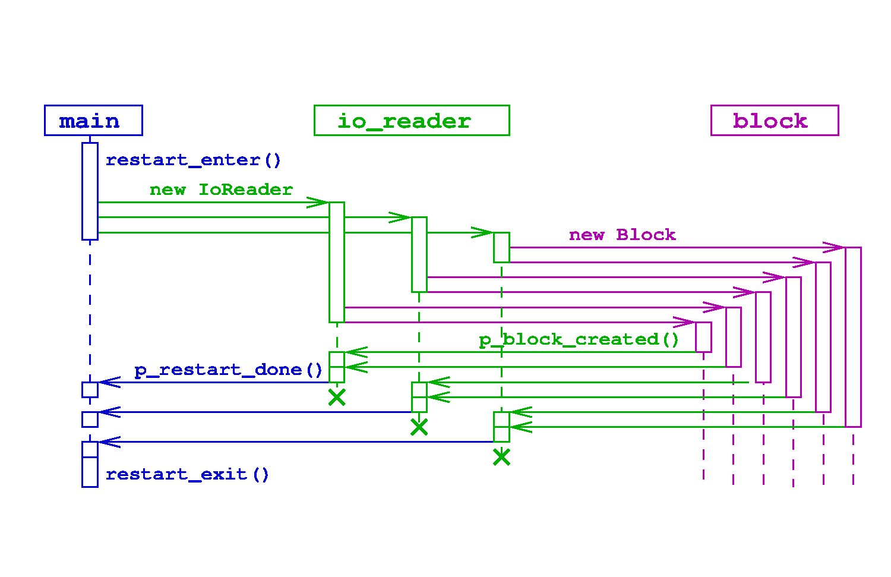

.. include:: ../roles.incl

******************
Scalable IO Design
******************
.. toctree::

============
Requirements
============

Three code functional requirements of I/O in Cello are:

  1. writing data dumps for subsequent reading by external
     analysis/visualization applications
  2. writing checkpoint files, and
  3. reading checkpoint files to restart a previously run simulation

(While writing image files such as "png" files is also included in the
I/O component of Cello, here we will focus on HDF5 files containing
actual block data.)

Additionally, writing and reading disk files must be scalable to the
largest simulations runnable on the largest HPC platforms available,
which necessarily include the largest parallel file systems available.

----------------------
Current implementation
----------------------

In Cello, "scalable I/O" is currently implemented using
``MethodOutput``. This is close to being suitable for requirement 1,
but has limitations in scalability and flexibility; in particular,
disk files are not load balanced. Checkpoint and restart (requirements
2 and 3) are currently implemented using Charm++, which has some
limitations in scalability (the file count can be excessive), and in
flexibility (simulations cannot be restarted with modified
parameters).

-----------------------------
Outline of new implementation
-----------------------------

The implementation will include modifications to how blocks are mapped
to files, what data are written to the files, and how file I/O is
parallelized.

Ordering
--------

Our new approach will involve a generalization of the ``MethodOutput``
method, but will enable load-balanced disk file through the use of
block `orderings` to define how blocks are mapped to files. Currently,
the ordering used in ``MethodOutput``, which is implicit and embedded
in the code, is based on a regular partitioning of root-level blocks
together with their descendents. The updated implementation will
factor out this ordering into an ``Ordering`` class, and allow
flexibility in defining other orderings, such as space-filling curves
like Hilbert or Morton.

File content
------------

The content of the data files must be augmented to include all data
required to recreate a previously saved AMR block array on restart.
Current data dump files do not include all required data, such as
block connectivity, scalar data, and other Block attributes used
internally.

Control flow
------------

Another difference between the proposed and current designs are how
individual tasks in an I/O operation are scheduled and synchronized.
In the current approach, a subset of root blocks is defined to be
"writers" or "readers", and they control requesting and writing data
from other blocks within their assigned scope. In the new approach, a
separate ``IoWriter`` or ``IoReader`` chare array will be used
instead.  Advantages are better load-balancing of I/O operations, and
decoupling of I/O operations from the Block chare array, which could
improve load balancing. For Enzo-E checkpoint/restart data,
``IoEnzoReader`` and ``IoEnzoWriter`` chare arrays are used.

======
Design
======

Components of the new I/O approach include

  1. Control management

     * ``control_restart.cpp``

        - ``Main::r_restart_enter()``
        - ``Main::p_restart_done()``
        - ``Main::restart_exit()``

  2. New Classes

     * ``EnzoMethodCheck``
     * ``IoEnzoReader``
        - ``IoEnzoReader::IoEnzoReader()``
     * ``IoEnzoWriter``
        - ``IoEnzoWriter::IoEnzoWriter()``
     * ``IoReader``
        - ``IoReader::IoReader()``
     * ``IoWriter``
        - ``IoWriter::IoWriter()``
     * ``Ordering``
     * ``OrderingHilbert``
     * ``OrderingRootBlocks``

----------
Algorithms
----------

Input algorithm
---------------

.. code-block:: C++

    // Begin reading restart data and create the mesh hierarchy of
    // EnzoBlocks. Replaces functionality of control_adapt.
    entry void enzo_main::r_restart_enter(std::string file_hierarchy)
    {
       // open hierarchy file
       // read hierarchy file
       // create block_array
       // create IoEnzoReader array
       // initialize sync_file(num_io_reader)
       for (i_f = files in restart) {
          io_reader[i_f].insert(file_block);
       }
       // close hierarcy file
    }

.. code-block:: C++

    // Read in a Block file and create all blocks in the file
    IoEnzoReader::IoEnzoReader(file_block)
    {
       // open block file
       // read block file
       // initialize sync_block(num_blocks)
       for (i_b = loop over blocks) {
          // read Block data
          // create Block, initialize, notify caller when done
          enzo_factory.create_block(block_data, io_reader, i_f);
       }
       // close file
    }

.. code-block:: C++

    // Initialize a block then notify caller when done
    Block::Block (block_data, io_reader, i_f)
    {
       // initialize Block using block_data
       io_reader[i_f].p_block_created(index);
    }

.. code-block:: C++

    // After all blocks created, notify main when done
    IoReader::p_block_created(Block index)
    {
       // Count blocks created
       if (sync_block.done()) {
          // After last block created, exit restart phase
          enzo_main::p_restart_done();
       }
    }

.. code-block:: C++

    // After all files have been read, proceed with the simulation
    main::p_restart_done() {
       if (sync_file.done()) {
          p_initial_done
    }

Output algorithm
----------------

.. image:: io-output.png

.. code-block:: C++

    // Begin writing a checkpoint file
    entry void EnzoMethodCheckpoint::apply(Block)
    {
       contribute (enzo_main::r_checkpoint_enter(std::string file_hierarchy));
    }

    entry void enzo_main::r_checkpoint_enter(std::string file_hierarchy)
    {
       // create hierarchy file
       // write hierarchy file
       // create IoEnzoWriter array
       // initialize sync_file(num_io_Writer)
       // Start io_writer with writer blocks by asking
       //    blocks to self-identify as writers
       block_array.p_io_write_start(io_writer, ordering);
    }

    EnzoBlock::p_io_write_start(io_writer, ordering)
    {
       if (io_writer.is_start(index)) {
       // determine index_file [0 .. num_io_writer) using num blocks and num files
          EnzoBlock::io_write_next(io_writer, ordering, index_file)
       }
    }

    EnzoBlock::[p_]io_write_next(io_writer, ordering, index_file)
    {
       // get next block index, and whether this is last block in file
        io_writer[index_file].write_block(block_data,ordering, index_next, l_last_block);
    }

    // Write a Block's data, and request next Block if any, else close and return
    IoEnzoWrite::write_block(block_data,ordering, index_next, l_is_first, l_is_last);
    {
       // if firstopen block file
       // read block file
       // initialize sync_block(num_blocks)
       for (i_b = loop over blocks) {
          // read Block data
          // create Block, initialize, notify caller when done
          enzo_factory.create_block(block_data, io_reader, i_f);
       }
       // close file
    }

    // Initialize a block then notify caller when done
    Block::Block (block_data, io_reader, i_f)
    {
       // initialize Block using block_data
       io_reader[i_f].p_block_created(index);
    }

    // After all blocks created, notify main when done
    IoReader::p_block_created(Block index)
    {
       // Count blocks created
       if (sync_block.done()) {
          // After last block created, exit restart phase
          enzo_main::p_restart_done();
       }
    }

    // After all files have been read, proceed with the simulation
    main::p_restart_done() {
       if (sync_file.done()) {
          p_initial_done
    }

-------
Classes
-------

EnzoMethodInput

=============
Communication
=============

=======
Testing
=======
