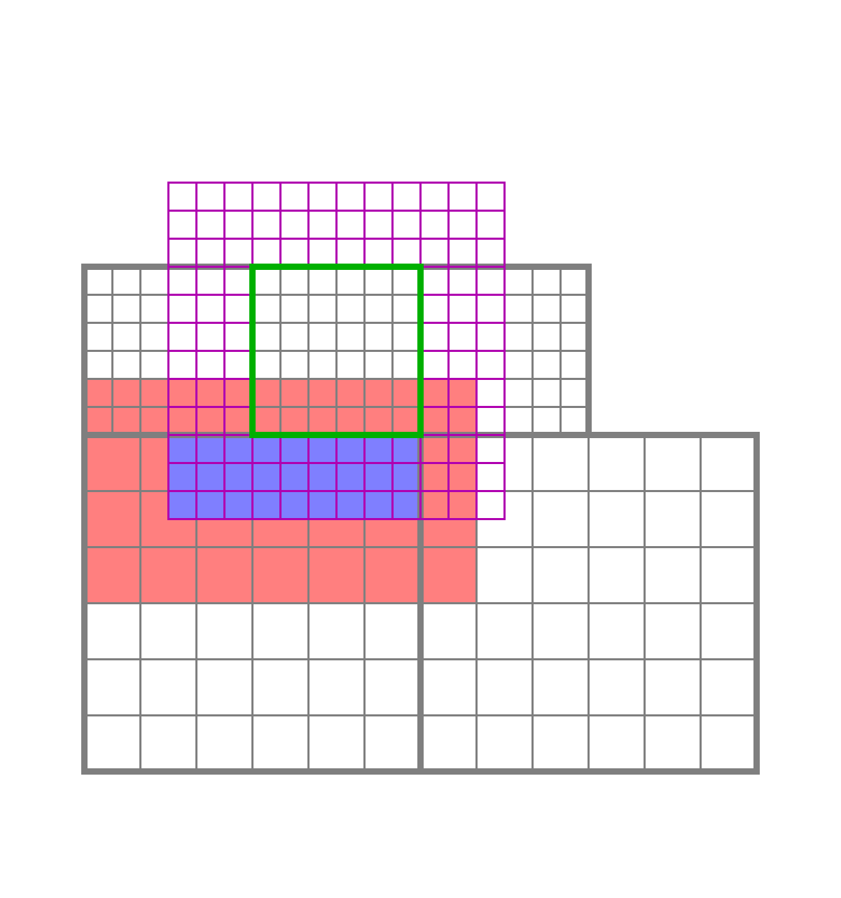
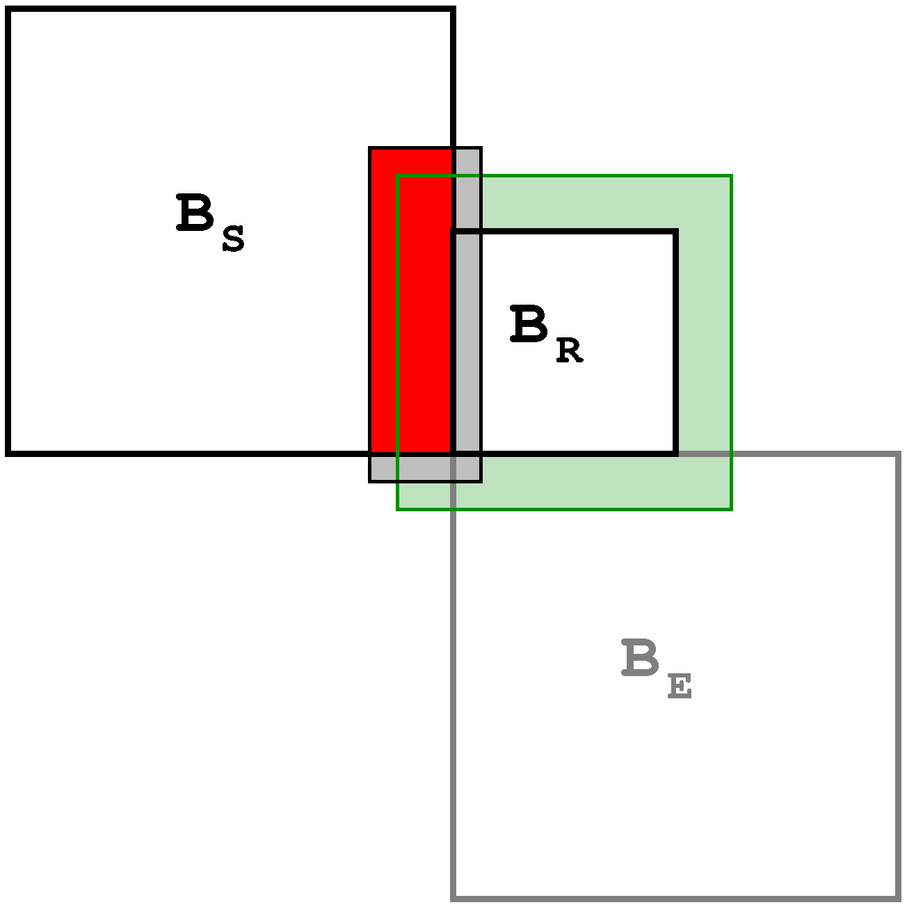
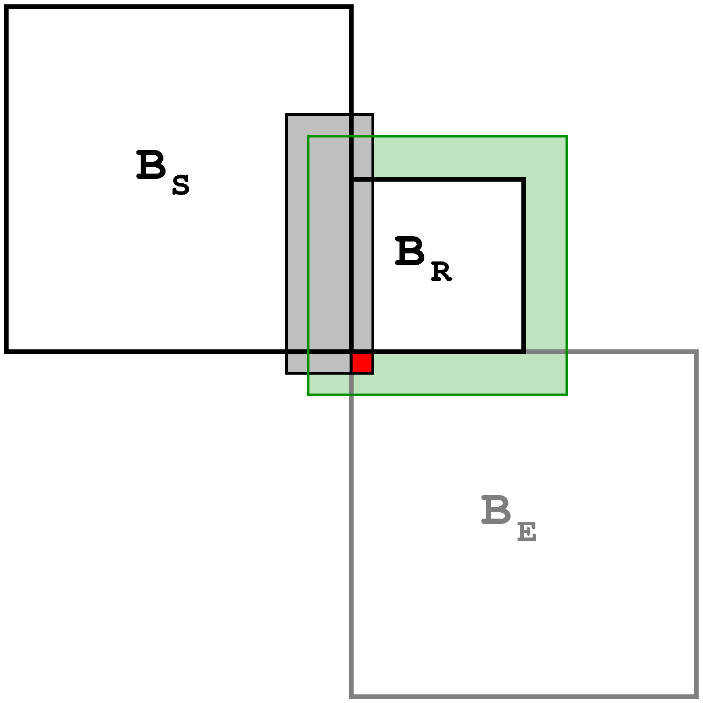
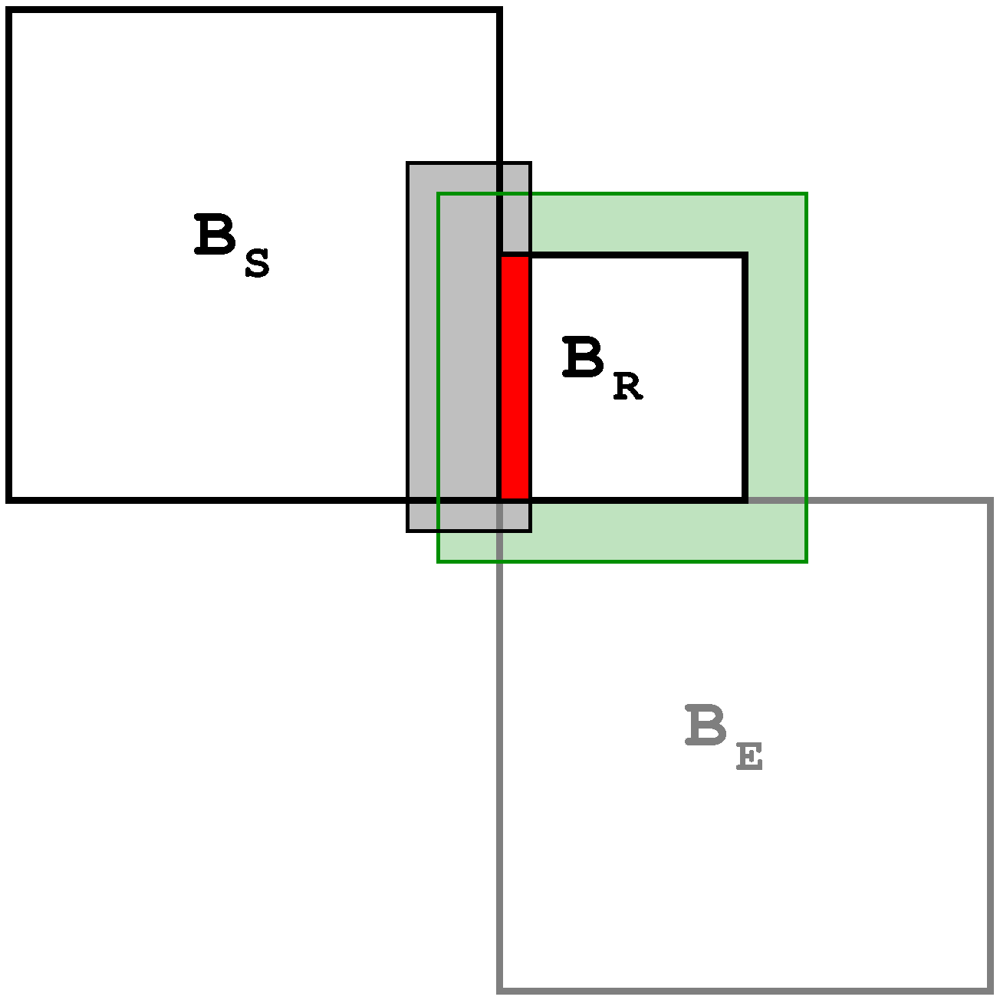

.. include:: ../roles.incl

********************
Interpolation Design
********************
.. toctree::

============
Requirements
============

This document describes incorporating "ENZO interpolation" into
Enzo-E; in particular, the "SecondOrderA" method.  This method
requires an extra layer of coarse-level cells compared to the basic
"trilinear interpolation" previously implemented in Enzo-E.
Implementing this requires additional communication, since this
augmented coarse-grid array overlaps multiple additional blocks.

    In ENZO's SecondOrderA interpolation method, multiple additional blocks
    intersect the extended array of coarse values (red) required for
    computing the interpolated ghost zone values (blue) for the fine block (green)
    that intersects a coarse block.          

======
Design
======

We decompose the operations required according to the role of blocks for each interpolation.
Note a given block may participate in multiple roles for different block faces.
There are three main block roles involved in an interpolation:

   1. **Sending block**
      
      a. sends its overlapped cell values to the receiver
         
   2. **Extra block**

      a. sends its overlapped cell values to the receiver

   3. **Receiving block**

      a. receives data from sending and extra blocks

      b. copies incoming data to padded array

      c. copies its own overlapped cells to the padded array

      d. calls the interpolation operation using the padded array to
         compute the interpolated ghost cell values

Some minor operations are not included, such as extra blocks that are
in the same level as the receiving block need to "coarsen" their
values before sending to the receiving block in operation 3.

Sending Block
=============

The sending block must send its data to the receiving block, as it
does for all other refresh operations.  The main difference is it
requires an additional layer of padding when sending.  This is handled
by the method ``Block::refresh_load_field_face_()`` in ``control_refresh.cpp``

Extra Block
===========

In addition to the sending block, some extra blocks must also send
their overlapped cell data to the receiving block.  This requires an
extra loop and some additional logic for a block to determine that it
must participate in an interpolation operation not as the sender or
receiver.  This is handled in the
``Block::refresh_load_extra_face_()`` method, which can be found in
the ``control_refresh.cpp`` source file.  Depending on the relative
mesh refinement level, an extra block may be handled
          
Receiving Block
===============

==========
Milestones
==========

=====
Tasks
=====
