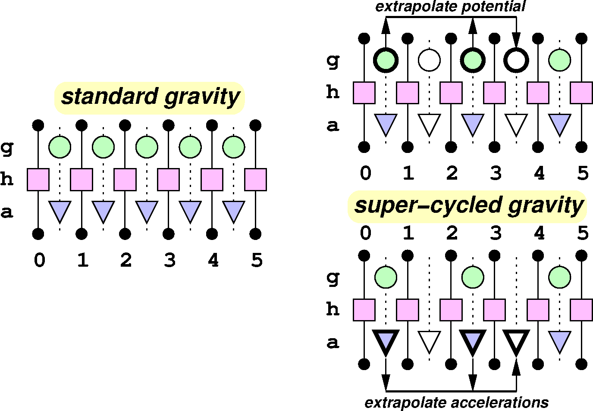

.. include:: ../roles.incl

.. |tijk| replace:: t\ :sub:`i` :sup:`j,k`

.. toctree::

.. _Adaptive Time-Step Design:

*************************
Adaptive Time-Step Design
*************************

At the core of an Enzo-E / Cello simulation is a sequence of physics
methods that is repeatedly applied to mesh blocks inside a loop, with
each cycle through the methods and blocks advancing the
simulation one global time-step. This document describes optimizations
related to how time-stepping is performed.

In a given cycle, each method / block pair has an associated maximum
local time-step, which is computed using the
``Method<Foo>::timestep(block)`` function. This applies the largest
time-step that the method can safely take on that particular block.
These local time-steps can be different for different methods, on
different blocks, and at different points in time.

The simplest time-stepping strategy is to use a constant global
time-step for each cycle, computed as the minimum local time-step over
all methods and blocks in the cycle. This is the approach that Enzo-E
/ Cello used initially. While easy to implement, depending on the
simulation characteristics it can be very inefficient.

Two ways to improve time-stepping performance are to 1) allow adaptive
time-stepping in different regions of the mesh, and 2) allow different
time-steps for different methods.  An example of 1) is the original
ENZO code: ENZO uses different time-steps on different mesh refinement
levels, which can significantly improve performance on mesh
hierarchies with many refinement levels. An example of 2) would be
advancing the gravitational potential, which can be costly due to its
global communication requirements, at a larger time-step than other
methods when possible.

Our plan is to optimize time-stepping in terms of both methods (via
"super-cycling") and individual blocks (via "block-adaptive
time-stepping").  We implement super-cycling first since it requires
less development time, but can still provide a significant improvement
in performance.

Lastly, we note that both super-cycling and block-adaptive approaches
are in a sense orthogonal to each other, so both approaches can be
used together as well as individually.

=====================
Super-cycling Gravity
=====================

As a driving use-case, we wish to super-cycle gravity solves with
respect to hydrodynamics. The rationale is that gravity solves are
relatively costly, and gravitational potentials typically evolve at
longer time-scales than hydro fields.

To super-cycle gravity, the user supplies a single integer parameter
:code:`Method : gravity : max_supercycle` that defines how frequently
the :code:`"gravity"` method is to be called with respect to other
methods. The default value of :code:`1` effectively turns off
super-cycling, whereas a value of :math:`k` allows other methods to be
called *up to* :math:`k` times for each call to the gravity
solve. Note that the maximum local gravity time-step restriction on
each block will still always be satisfied, even if the
:code:`max_supercycle` parameter is set to an arbitrarily large value.

For cycles where the gravitational potential solve is not performed,
extrapolations of saved fields are used to approximate the current
fields.  Which fields to be extrapolated is determined by the
:code:`Method : gravity : type_super` parameter, which can be either
:code:`"potential"` or :code:`"accelerations"`. The default is
:code:`"accelerations"`, which is preferred since extrapolating
potentials can introduce grid effects at refinement level
boundaries. The figure below illustrates these two variations of
super-cycling gravity as compared to non super-cycled gravity.

           This figure illustrates standard versus super-cycled
           gravity. Time runs horizontally left-to-right. Green
           circles represent linear solves for gravitational
           potential, magenta squares represent hydro solves, and blue
           triangles represent accelerations computed from potentials.
           White fields are extrapolated from previously computed
           values.  The left figure shows standard gravity with
           gravity solves every cycle; the figures to the right show
           super-cycled gravity, with the upper-right variation
           showing extrapolated gravitational potentials, and the
           lower-right variation showing extrapolated accelerations.

------------------------
non super-cycled gravity
------------------------

The gravitational potential is used to compute gravitational
accelerations, which are applied to all gravitating particles and
fields. We use a leapfrog integration scheme because it is 2nd order
accurate (small short-scale errors) and symplectic (qualitatively
correct long-scale behavior). This involves computing time-centered
accelerations. Since we start with non-time centered values, we must
either extrapolate the input (density) to the gravity solve, or
extrapolate the output (potential) from the gravity solve. In both
ENZO and Enzo-E, the extrapolation is done before the gravity solve.

.. math::
   \rho_{i+1/2} &\leftarrow \mbox{extrapolate}(\rho_{i-1},\rho_{i}) \\
   \bar\rho_{i+1/2} &\leftarrow \mbox{shift_and_scale}(\rho_{i+1/2}) \\
   \mbox{solve } \nabla^2 \phi_{i+1/2} &= \bar\rho_{i+1/2} \\
   \vec{a}_{i+1/2} &\leftarrow \nabla \phi_{i+1/2}

--------------------
super-cycled gravity
--------------------

When super-cycling gravity, cycles are categorized as "solve cycles"
or "non-solve cycles".  In solve cycles, the algorithm is the same as
for non super-cycled gravity, with the additional step of saving
either the computed potential field or the computed acceleration fields,
depending on the variant. In non-solve cycles, the solve is replaced
by extrapolations of the fields for that variant:

Non-solve cycle (extrapolated potential variant)

.. math::
   \phi_{i+1/2} &= \mbox{extrapolate}(\phi_{s_1},\phi_{s_2}) \\
   \vec{a}_{i+1/2} &\leftarrow \nabla \phi_{i+1/2}

Non-solve cycle (extrapolated accelerations variant)

.. math::
   \vec{a}_{i+1/2} = \mbox{extrapolate}(\vec{a}_{s_1},\vec{a}_{s_2})

============================
Block-adaptive Time-Stepping
============================

In this section we introduce some notation to help in describing
block-adaptive time-stepping algorithms.

----------------
Cycles and steps
----------------

Traditionally in Enzo-E, we use the term "cycle" to represent a unique
global time-step. With adaptive time-steps, however, at any given time
different methods or different blocks may be taking different time
steps, so this is insufficient.  We use the term "step" to indicate
subdivisions within a cycle. The largest time-step of any method and
block determines the cycle interval length. Steps are indexed within
the cycle, so step 0 is the first step, and the number of steps
depends on the method and/or block. For globally constant
(non-adaptive) time-steps, there is a single step 0 that coincides
with the cycle.

.. figure:: dt-cycle-step.png
           :width: 400

           This figure illustrates cycles (time intervals between
           :math:`t_0` and :math:`t_1`, and between :math:`t_1` and
           :math:`t_2`) and steps (rectangular regions within cycles)
           for two methods running on three blocks.

One constraint we impose on steps is that they are "quantized", that
is have the value :math:`2^k` for some integer value :math:`k`. Since
cycles are defined as the largest step over all blocks and methods,
this applies to cycles as well. This constraint may be relaxed in some
cases, for example with non-adaptive time-steps; however, having
quantized time-steps can improve accuracy and help maintain other
favorable properties in some numerical methods where error terms
cancel due to symmetry.

Notation concerning time-steps are summarized below:

* **step**: time intervals associated with a particular method on a particular block, notated as :math:`(i,j)` where :math:`i` is the "cycle" number (see below)
  and :math:`j` is the step index starting from 0. Steps within a cycle
  may have different sizes.
* **cycle**: time interval defined as the minimal interval such that steps for all methods on blocks align at the end points. Typically indexed using the
  variable :code:`i`, and determined by the method with the longest (non-supercycling) time-step on all blocks.
* **cycle depth**: ratio of the cycle length with the smallest step in the cycle.
* :math:`\overline{dt}_{i,j}^{b,m}` : Computed time-step at step :math:`(i,j)` on block :math:`b` for method m, provided by :code:`Method::time-step()`
* :math:`dt_{i,j}^{b,m}`: Actual (quantized) time-step at step :math:`(i,j)`  on block :math:`b` for method m, defined as :math:`dt_{i,j}^{b,m} \equiv \{2^\tau : 2^\tau \le \overline{dt}_{i,j}^{b,m} < 2^{\tau+1}, \tau \in \mathbb{Z} \}`
* :math:`\tau_{i,j}^{b,m}`: Integer defining the actual time-step: see :math:`dt_{i,j}^{b,m}`
* :math:`dt_{i,j}^{m}`: Minimum time-step at step :math:`(i,j)` for method :math:`m` over all blocks
* :math:`dt_{i,j}^{b}`: Minimum  time-step at step :math:`(i,j)` for block :math:`b` over all methods
* :math:`dt_{i,j}`: Minimum time-step at step :math:`(i,j)` for all blocks with all methods
* :math:`t_{i,j}^{b,m}`: Time at the start of cycle :math:`(i,j)` on block for method m

.. note::

   Some of the above definitions need to be revised. For example,
   those beginning with "minimum time-step at step (i,j)" assume that
   j indices for different blocks and methods are aligned, but in
   general will not be.

