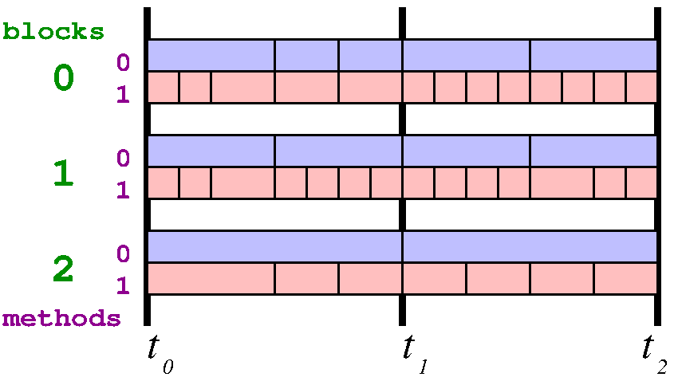

.. include:: ../roles.incl

.. |tijk| replace:: t\ :sub:`i` :sup:`j,k`

.. toctree::

.. _Adaptive Time Step Design:

*************************
Adaptive Time Step Design
*************************

========
Notation
========

In this section we introduce some notation to help in describing
adaptive time stepping algorithms.

----------------
Cycles and steps
----------------

Traditionally in Enzo-E, we use the term "cycle" to represent a unique
global time step. With adaptive time steps, however, at any given time
different methods or different blocks may be taking different time
steps, so this is insufficient.  We use the term "step" to indicate
subdivisions within a cycle. The largest time step of any method and
block determines the cycle interval length. Steps are indexed within
the cycle, so step 0 is the first step, and the number of steps
depends on the method and/or block. For globally constant time steps
for each cycle, there is a single step 0 that coincides with the
cycle.

           This figure illustrates cycles (time intervals between
           :math:`t_0` and :math:`t_1`, and between :math:`t_1` and
           :math:`t_2`) and steps (rectangular regions within cycles)

One constraint we impose on steps is that they are "quantized", that
is have the value :math:`2^k` for some integer value :math:`k`. Since
cycles are defined as the largest step over all blocks and methods,
this applies to cycles as well. This constraint may be relaxed in some
cases, for example with non-adaptive time steps; however, having
quantized time steps can improve accuracy and help maintain other
favorable properties in some numerical methods where error terms
cancel due to symmetry.

Notation concerning time steps are summarized below:

* **step**: time intervals associated with a particular method on a particular block, notated as :math:`(i,j)` where :math:`i` is the "cycle" number (see below)
  and :math:`j` is the step index starting from 0. Steps within a cycle
  may have different sizes.
* **cycle**: time interval defined as the minimal interval such that steps for all methods on blocks align at the end points. Typically indexed using the
  variable :code:`i`.
* **cycle depth**: ratio of the cycle length with the smallest step in the cycle.
* :math:`\overline{dt}_{i,j}^{b,m}` : Computed time step at step :math:`(i,j)` on block :math:`b` for method m, provided by :code:`Method::timestep()`
* :math:`dt_{i,j}^{b,m}`: Actual (quantized) time step at step :math:`(i,j)`  on block :math:`b` for method m, defined as :math:`dt_{i,j}^{b,m} \equiv \{2^\tau : 2^\tau \le \overline{dt}_{i,j}^{b,m} < 2^{\tau+1}, \tau \in \mathbb{Z} \}`
* :math:`\tau_{i,j}^{b,m}`: Integer defining the actual time step: see :math:`dt_{i,j}^{b,m}`
* :math:`dt_{i,j}^{m}`: Minimum time step at step :math:`(i,j)` for method :math:`m` over all blocks
* :math:`dt_{i,j}^{b}`: Minimum  time step at step :math:`(i,j)` for block :math:`b` over all methods
* :math:`dt_{i,j}`: Minimum time step at step :math:`(i,j)` for all blocks with all methods
* :math:`t_{i,j}^{b,m}`: Time at the start of cycle :math:`(i,j)` on block for method m

===============
Data structures
===============

Most data structures remain the same, but some small amount of extra
functionality is desired to simplify adaptive time stepping.  The main
one is being able to access field and particle values at some other
time than explicitly available, using interpolation or in some cases
extrapolation of saved values. We would like this to be as seemless as
possible to the Methods.

------
Fields
------

For Fields we wish to have access to field values at times that don't
necessarily correspond to the stored times. This can be accomplished
by augmenting the :code:`Field:values()` method with an extra optional
parameter specifying the time at which to access the
field. Internally, it checks whether the desired time equals one of
the times for the saved computed values. If one matches, it simply
returns the corresponding field; if not, it uses existing field values
to interpolate or, if necessary, extrapolate existing field
values. Warnings can be configured for extrapolating beyond some
user-determined amount that would introduce too large an error, with
a value of 0 implying any amount of extrapolation would flag an
error.

One small complexity is that memory must be allocated when the desired
time is not found in the history, but otherwise should not be. To deal
with this, we return the field values as a C++ :code:`shared_ptr`, a
smart pointer that handles deallocating allocated memory
automatically. Note we cannot use the preferred :code:`unique_ptr`
because we need a custom deleter, which is only available with
:code:`shared_ptr`.

---------
Particles
---------

For particles we wish to have access to particle positions and other
attributes at times that don't necessarily correspond to the stored
times. Again, this could be accomplished by augmenting the
:code:`Particle` class to allow a time parameter for accessing
attributes, and temporary particles could be created in a similar
manner as temporary fields for when requested times don't match
available times.

One significant complexity is that particles can migrate onto or off
of a block, which must be dealt with since computation in Enzo-E is
block-based. Introducing "ghost particles" for particles that lie
close to but not within a block's scope is a possible solution.

==========
Parameters
==========

Additional parameters will be required to implement adaptive time
stepping. In the subsections below we enumerate these additional
parameters.

--------------------------------
Super and sub-cycling parameters
--------------------------------

* :code:`Method : <method> : dt_ratio_min`
* :code:`Method : <method> : dt_ratio_max`

Additional parameters are required to define how methods are to be
sub- or super-cycled with respect to each other. For this we use
parameters :code:`dt_ratio_min` and :code:`dt_ratio_max`. These are
defined for each method, with default values for both being 1.0.
:code:`dt_ratio_min` < 1.0 allows for subcycling of a particular
method up to the given amount, and :code:`dt_ratio_max` > 1.0 allows
for super-cycling a method up to the given amount. Note that both can
be "engaged", so that a method can either super- or sub-cycle with
respect to other methods. The amount is relative to methods with
:code:`dt_ratio_min` = :code:`dt_ratio_max` = 1.

* :code:`Adapt : time_step_type`

Adaptive time stepping is enabled using :code:`Adapt : time_step_type`
which has allowed values :code:`none` (default), :code:`method` (for
sub-/super-cycling), and :code:`block` (for local adaptive
time stepping). The type can be a list containing both :code:`block`
and :code:`method`.

