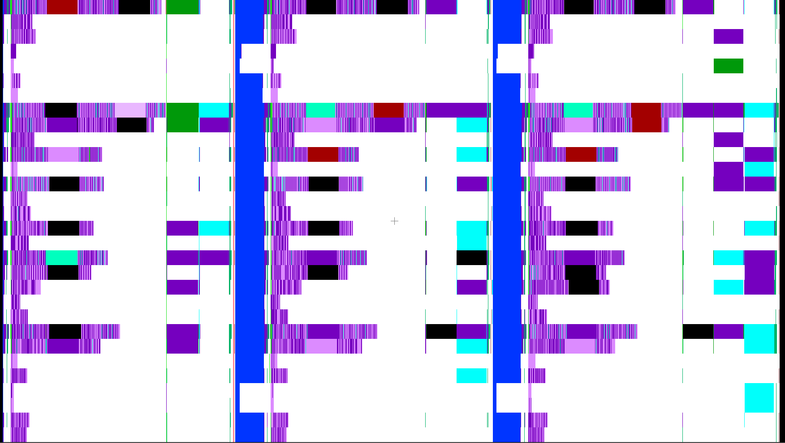
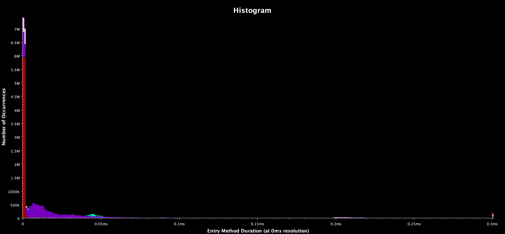
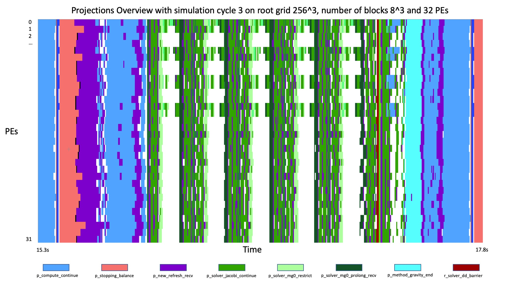
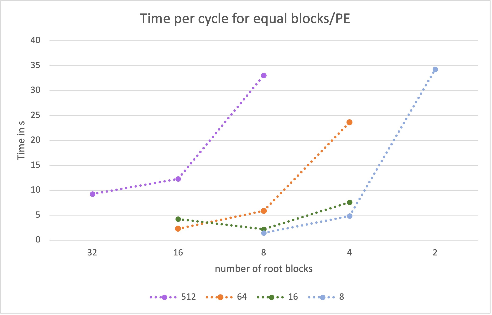
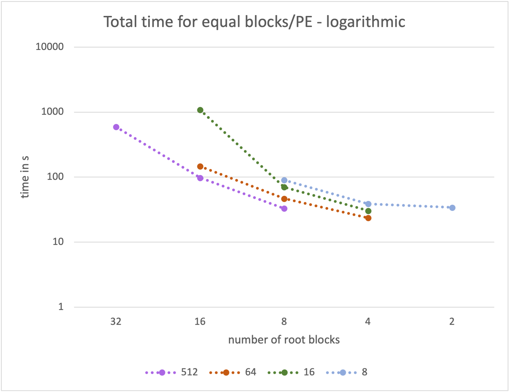

===========================
Gravity Solver Optimisation
===========================

This document will outline the results of optimisations on the gravity solver 
performed by a team of scientists consisting of Dr. John Regan and Dr. Stefan 
Arridge from Maynooth University and Sophie Wenzel-Teuber and Dr. Buket Benek 
Gursoy from the Irish Centre for High End Computing (ICHEC, part of NUI Galway). 

Summary
-------

We investigated test problems with 16^3, 32^3, 64^3, 256^3 root grid, varying
number of blocks and number of PEs, with/without AMR, for around 200 cycles. 
Furthermore, we analysed the bottleneck of the simulations with a
profiler and present a runtime analysis. Specifically, for dark-matter-only
cosmology runs, and 256^3 unigrid, the optimal setup was found to be 8^3
blocks, each of size 32^3. The effects of changing parameters such as 
``min_level`` and the number of V-cycles on code performance were also analysed.
It was observed that it is unlikely to achieve much speed-up just from changing
some parameters in the configuration file. 
A new feature was implemented in the code to allow refresh operations to have
different values for ``min_face_rank`` and by using a smaller ``ghost_depth`` a
decrease in runtime of 30% could be achieved for a unigrid simulation.

Profiling with Projections
--------------------------

Charm++ has the possibility to gather tracing data of all entry functions and a 
visualisation tool called Projections. 

The tracing data logs which processes executes which entry function at which 
point in time and for how long. This creates one log file per PE. The size of
these log files can be set with the ``+logsize`` parameter. 
Whenever this size is exceeded the logs are flushed to disk. This I/O can 
heavily influence the tracing results as it will appear as a long execution of 
an entry function in the data.

The Projections visualisation tool provides many possibilities to view this 
tracing data. The following image is a screenshot from a gravity simulation 
with 30 PEs on a grid of 64x64x64 cells, divided into 4 blocks per dimension.

All tracing and runtime measurements have been performed on ICHEC's 
supercomputer on one or two nodes consisting of 40 Intel Skylake processors each
and 192GiB (1.5TiB) RAM.

The X axis shows the time of 3 cycles (203-205) and the Y axis has one line
per PE of colour codes for the entry functions this PE executed. White signals 
idle time.

The purple coloured lines are the refresh routine (functions 
``p_dot_recv_children`` in the brighter and ``p_new_refresh_recv`` in the 
darker shade).

The blue columns represent the ``r_stopping_compute_timestep`` function and
signal the end of one and beginning of a new timestep. The equal length of this 
function for almost all PEs suggest that the log data was flushed during the 
execution of this function. Therefore, the execution time shown in the image is 
not representable for the real runtime. The same is true for equally sized
time spans in other functions throughout the plot.

Especially the black blocks that represent "overhead" probably have to be 
neglected as well as this overhead almost never appears in plots without the 
problem of flushing log files to disk.

However, what can safely be said is that the refresh routine plays a vital role 
for the performance of this Enzo-E simulation.

Other plots of Projections show that the refresh routine alone accounts for more
than 24 million messages in the 3 cycles above of which most result in an entry
function execution time of less than 0.02s. 

This image shows a histogram of the execution times of the messages for the 
entry functions.

Purple coloured are the refresh functions as above. Red represents
``p_control_sync_count``, which is also called in this routine to query the 
refresh state of a blocks neighbours. 

When disabling the adaptive mesh refinement and running in a unigrid mode the 
effect of the refresh routine is much smaller and the stages of the simulation
can be identified in the overview.

This simulation was run on a grid of 256 cells cubed, divided into 8 blocks per
direction and parallelised over 32 PEs.

The five cycles of the Multigrid solver are clearly distinguishable because all 
PEs except one are idle. The number of V-cycles can be adjusted in the parameter
file and will automatically reduce due to a smaller residual later in the
simulation.
Less coarsening of the grid such that more than only one processor is solving
the problem and therefore reducing the idle time of the other processors is
possible by adjusting the ``min_level`` parameter but results in longer
runtimes (presumably due to communication).

The function ``p_compute_continue`` also has a large 
impact on the simulation time and is accountable for starting all solvers that
are linked to the simulation.

Runtime analysis for unigrid on a single node
---------------------------------------------

To compare parameters and runtime settings in future analysis a good setup has 
to be found first that can yield the baseline for performance observations.

All combinations of the grid sizes 32, 64 and 256 cubed, the number of blocks of
2, 4, 8, 16, 32 and 64 per direction (where applicable) and the number of PEs 
of 2, 4, 8, 16, 32 and 64 (also where applicable) were run for a simulation 
without adaptive mesh refinement for clarity.

This provides a lot of numbers that are difficult to compare. The goal is to 
find metrics that cover a beneficial balance between a good workload per PE and
therefore a performance utilisation of the resources, and a high
parallelisation.

What was used is a mixture of weak and strong scaling: 
The following plot shows the runtime per cycle (``total runtime / number of 
cycles``) for a simulation size of 256 cubed for four constant numbers of 
blocks per PE. 

For example for a number of 64 blocks per PE the runtimes were calculated for

* 16^3 blocks on 64PEs
* 8^3 blocks on 8 PEs 
* 4^3 blocks on 1 PE.

This means in the graph above from left to right the blocks become larger but
with less parallelisation. Therefore, each PE has more to calculate on the right
side of the graph than on the left, but less to communicate.

A similar plot can be created for the accumulated time of all PEs to perform 
one cycle - this is the value from above multiplied by the number of PEs. This
relates to the CPU time needed to complete one step of the simulation.

From this graph it is clear that it is more efficient to compute larger blocks 
on fewer PEs.

Clearly, both representations have to be combined as each one is insufficient
for an educated guess of a balanced setup.
From this combination we concluded that a good initial setup of the simulation
for further tests is using 32PEs and 8 blocks on a grid of 256 cubed cells 
(which relates to the mid point of the green line in the two plots above).

These metrics fail at smaller simluation sizes for two reasons: The amount of 
computational work can be viewed as too small compared to the overhead and the
parameter space is not sufficient to produce enough results for meaningful
graphs of the metrics mentioned above. 
It is still the case however that fewer but larger blocks and fewer PEs result
in less CPU time per cycle (again, due to the reduced overhead for
communication).

Refresh routine
---------------

As mentioned above the refresh routine is the most limiting factor in a single
node AMR run.

How large the ghost zones are that are copied and how many neighbours take part
in the exchange is parameterised by two variables.

The ``ghost_depth`` that determines the number of cells that are copied in a 
direction was set to 4 in the runs above which is a necessity at the moment.
Significant code changes would be required to adapt this value for the
distinctive refresh routines started by the different parts of Enzo-E.

Only in a simulation on a uniform grid this value can be decreased. Comparing
the runtime of simulations with a ghost depth of 2 and 4 resulted in a 
decrease from 2.7872s to 2.1578s (speedup of 1.292) for a simulation with the 
setting determined in the method above (256^3 cells in 8^3 blocks and 32 
PEs).

Another parameter are the number of neighbours that exchange their ghost zones.
In a three dimensional grid a cell has 26 neighbours. 6 of them share a face, 
12 share an edge and 8 only a corner.

Depending on the algorithm only the data from neighbouring faces is used. 
Therefore, it is enough for the refresh routine to only exchange data from 
these neighbour blocks. 

The variable to determine how many neighbours are used for the refresh is called
``min_face_rank``. A small code change allowed for this to be set when
constructing refresh objects. For the same simulation parameters as above this 
resulted in a difference of from 2.0589s to 1.9297s (speedup of 1.067) per cycle
for a unigrid and from  89.0964s to 89.5893s per cycle for an AMR run. 
The runtime of the AMR simulation has been averaged over all 160 cycles even 
though the simulation the mesh is not refined in the first ~100 cycles. 
Therefore, these numbers have to be treated with caution.

Combining both approaches is as mentioned only possible in a unigrid simulation
but adds up to a decrease in runtime of roughly 30% (calculated from a decrease
of the time per cycle from 2.8122s to 1.9586s).

Future Work
-----------

While this document summarises successful outcomes on the gravity solver
optimisation there is still further work that could potentially be carried out.
However, further optimisations are likely to be challenging and would require
extensive code changes like implementing a more effective smoother such as
red-black Gauss-Seidel, doing multiple Jacobi smoothings per refresh, or
implementing full-multigrid method instead of V-cycles. 
Another potential work would be to investigate an alternative strategy for
computing gravitational forces e.g. through the use of 3D parallel FFT.
