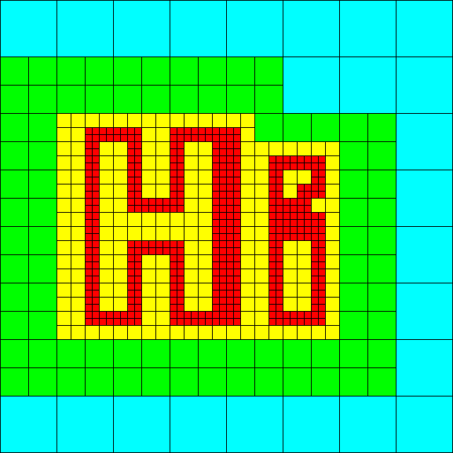
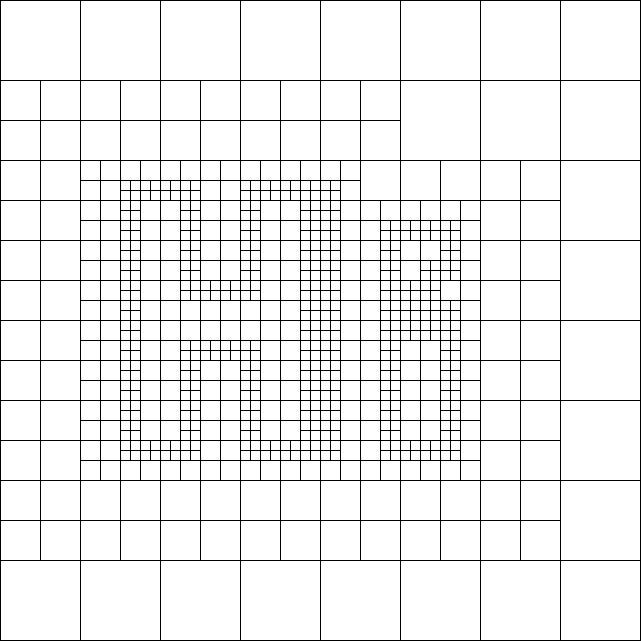
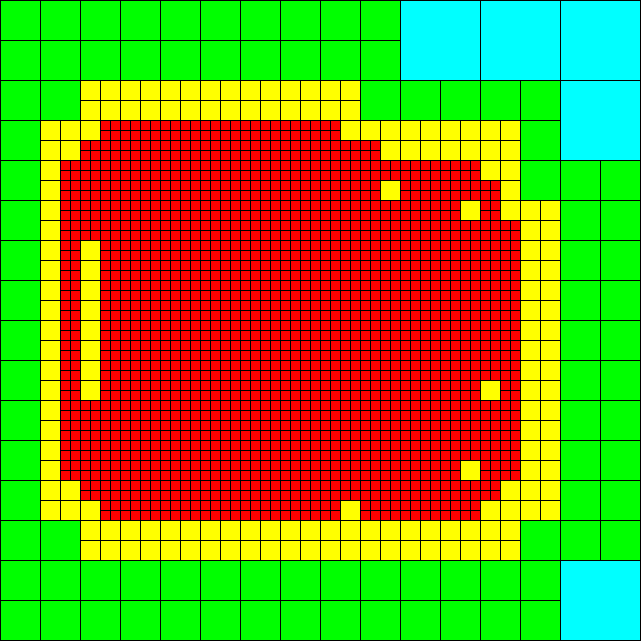
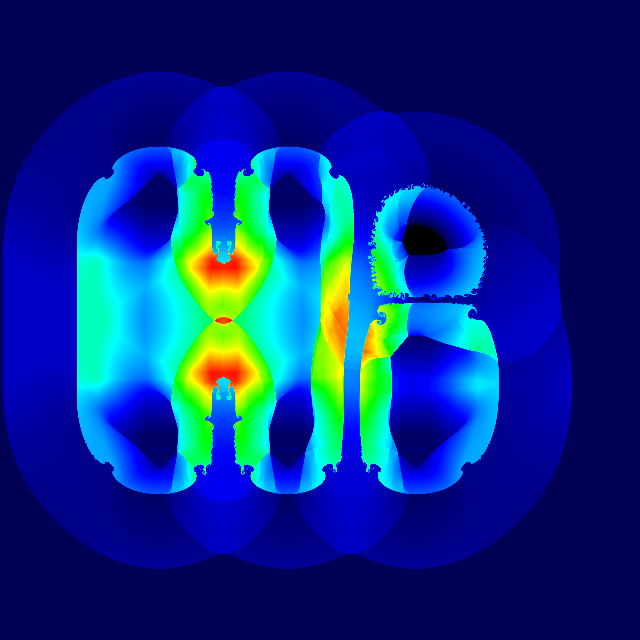
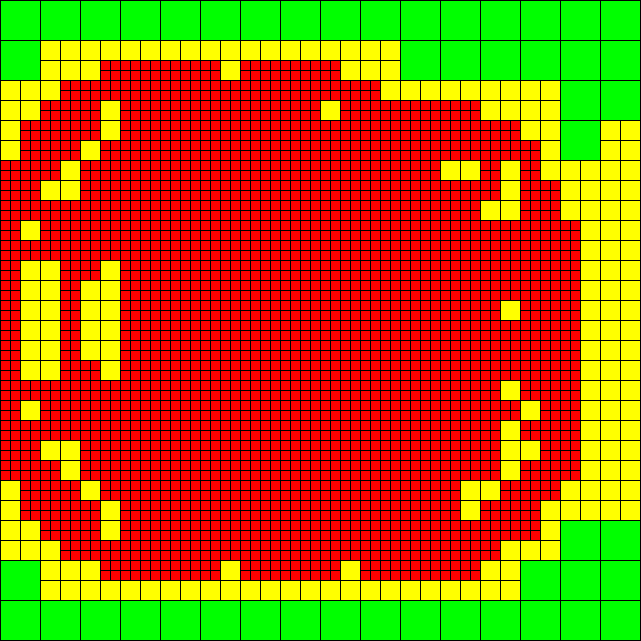

.. _getting_started:

----------------------------
Getting started using Enzo-E
----------------------------

This page will help you get Enzo-E and Cello up and running.  It
covers downloading the source code, porting the code to new platforms,
configuring and compiling the code, and running a sample test problem.

Other pages are available for helping to get started on specific
architectures, including the "Comet" supercomputer at San Diego
Supercomputing Center (SDSC), and the NSF Petascale supercomputer "Blue
Waters" at the National Center for Supercomputing Applications (NCSA).

.. toctree::
   :maxdepth: 1
	   
   getting_started_comet
   getting_started_blue_waters

Downloading
===========

``Enzo-E / Cello`` is currently hosted on github.com (previously bitbucket.com)in beta-testing.  To obtain the latest
version of the source code, you may clone it from the
repository `Enzo-E / Cello github repository
<https://github.com/enzo-project/enzo-e.git>`_:

   ``git clone https://github.com/enzo-project/enzo-e.git``

Before compiling ``Enzo-E / Cello``, you may also need to download
and install 1.``Charm++``, 2.``HDF5``, 3.``libpng``, and 3.``libboost``:

1. Install ``Charm++``
----------------------

``Charm++`` can be `downloaded here <http://charm.cs.illinois.edu/software>`_.

To build Charm++ on a Mac, try this:

   ``./build charm++ netlrts-darwin-x86_64 gcc gfortran -j4 --with-production``

If you're running Linux, try building Charm++ using this:

   ``./build charm++ netlrts-linux-x86_64   -j4  --with-production``

Charm++ also provides a helpful interactive script ``smart-build.pl`` that can
be used to configure and install ``Charm++`` on numerous other platforms.

2. Install ``HDF5``
-------------------

"`HDF5 <http://www.hdfgroup.org/HDF5/>`_ is a "data model, library, and
file format for storing and managing data", and is the primary library
used by Enzo-E / Cello for data output.

If HDF5 is not already installed on your machine, it may be available
through your operating system distribution, otherwise it can be
downloaded from the `HDF5 <http://www.hdfgroup.org/HDF5/>`_ website.
Enzo-E / Cello currently uses the "serial" (non-MPI) version of HDF5.

3. Install ``libpng``
---------------------

"`libpng <http://www.libpng.org/pub/png/libpng.html>`_ is the official
PNG reference library", and is the image format used by Enzo-E / Cello.

If ``libpng`` is not already installed on your machine, it may be
available through your operating system distribution, otherwise it can
be downloaded from the `libpng
<http://www.libpng.org/pub/png/libpng.html>`_ website.

4. Install ``libboost-dev``
---------------------------

"`Boost <https://www.boost.org/>`_ provides free peer-reviewed portable C++ source libraries."

If ``libboost-dev`` is not already installed on your machine, it may be
available through your operating system distribution, otherwise it can
be downloaded from the `libboost <https://www.boost.org/>`_ website.

Configuring
===========

There are currently two configuration settings that must be set before
building Enzo-E and Cello: ``CELLO_ARCH`` to specify the computer platform,
and ``CELLO_PREC`` to specify the floating-point precision.

Other optional settings are available as well.  These are initialized
in the top-level SConstruct file under the "USER CONFIGURATION"
heading.  Please consult the SConstruct file itself for documentation on
these optional settings.

1. Specify machine
------------------

Before compiling Enzo-E / Cello, you first have to define which set of
available machine-dependent configuration settings to use via the
``CELLO_ARCH`` environment variable.  Some examples include the
following:

   ===========================  ========================================================
   ===========================  ========================================================
   ``CELLO_ARCH=linux_gnu``     *compile for a generic GNU Linux system*
   ``CELLO_ARCH=ncsa_bw``       *compile for NCSA's Blue Waters Petascale Platform*
   ``CELLO_ARCH=gordon_gnu``    *compile for SDSC's Gordon (Or Comet) cluster using GNU compilers*
   ===========================  ========================================================

Note that some machines, including Blue Waters and Comet, will
additionally require certain modules to be loaded, including compilers
and HDF5.  See the corresponding getting started pages :ref:`Comet` or
:ref:`Blue_Waters` for architecture-specific details.

See the porting_ section below for how to add your own architecture to
the list, or how to modify the settings for these machines.

2. Specify precision
--------------------

Enzo-E must be compiled either using single-precision or
double-precision.  To specify the precision to use in Enzo-E, set the
``CELLO_PREC`` environment variable:

  =====================  ======================
  =====================  ======================
  ``CELLO_PREC=single``  *32-bit Enzo field data*
  ``CELLO_PREC=double``  *64-bit Enzo field data*
  =====================  ======================

Porting
=======

.. _porting:

If Cello does not support your desired hardware platform, you will
have to provide settings so that the build system knows what compilers
to use, plus any optimization settings, library paths, etc.  This is
done by creating a new machine configuration file in the ``config/``
subdirectory, and editing the top-level ``SConstruct`` file to read
your new machine configuration file.

1. Create config file
---------------------

Machine configuration files are found in the ``config/`` subdirectory.
To create a new one for your machine, try copying an existing one
and editing it.  Configuration variables include the following:

  =====================  ======================================================================
  =====================  ======================================================================
  ``is_arch_valid``      This must be set to 1
  ``flags_arch``         Compiler flags, such as optimization settings or warning levels
  ``flags_link_charm``   Link flags, such as optimization settings
  ``cc``                 The C compiler to use
  ``f90``                The Fortran compiler to use
  ``flags_prec_single``  Fortran flags for using single-precision by default
  ``flags_prec_double``  Fortran flags for using double-precision by default
  ``libpath_fortran``    Path for any Fortran libraries required when linking with C++
  ``libs_fortran``       Fortran libraries required when linking with C++
  ``charm_path``         Path to the ``Charm++`` installation directory
  ``papi_inc``           Path to PAPI performance library include files (OPTIONAL)
  ``papi_path``          Path to PAPI performance library library files (OPTIONAL)
  ``hdf5_inc``           Path for HDF5 include files
  ``hdf5_lib``           Path for HDF5 library files
  ``png_path``           Path to the ``libpng`` library
  ``grackle_path``       Path to the Grackle chemistry and cooling library (OPTIONAL)
  =====================  ======================================================================

2. Edit ``SConstruct``
----------------------

To incorporate your new machine configuration file into the ``Enzo-E /
Cello`` build system, insert a new line to the following list in the
``SConstruct`` file in the top-level ``Enzo-E / Cello`` directory:

  ::   

     if   (arch == "gordon_gnu"):   from gordon_gnu   import *
     elif (arch == "gordon_intel"): from gordon_intel import *
     elif (arch == "gordon_pgi"):   from gordon_pgi   import *
     elif (arch == "linux_gnu"):    from linux_gnu    import *
     elif (arch == "linux_gprof"):  from linux_gprof  import *
     elif (arch == "linux_mpe"):    from linux_mpe    import *
     elif (arch == "linux_tau"):    from linux_tau    import *
     elif (arch == "ncsa_bw"):      from ncsa_bw      import *

Building
========

After configuring Cello for your computer, the Cello framework and
Enzo-E application can be compiled using "make", which in turn calls
the included ``./build.sh`` script.  Other options are available for
generating useful `http://orgmode.org/ <org-mode>`_ files, generating
doxygen documentation, running
regression tests, and running code analysis tools.

        ==================  ===============================================================
        ==================  ===============================================================
	``make``            *Compile Enzo-E as* ``./bin/enzo-p``
	``make clean``      *Remove object and test files*
	``make reset``      *Clear any settings from an incomplete build*
	``make doc``        *Generate doxygen documentation from source in* ``src-html`` *(requires* ``doxygen`` *)*
        ``make test``       *Run regression tests*
	``make diff``       *Generate org-mode* ``'diff.org'`` *file from* ``'hg diff'`` *output*
	``make log``        *Generate org-mode* ``'log.org'`` *file from* ``'hg log'`` *output*
	``make gdb``        *Generate org-mode* ``'gdb.org'`` *from gdb* ``'where'`` *output in* ``gdb.out``
        ``make cccc``       *Compute code quality metrics in* ``src/.cccc/cccc.html``
	``make coverity``   *Compile Enzo-E / Cello using the Coverity static analysis tool*
        ==================  ===============================================================

Running
=======

In this section we run Enzo-E on a simple "Hello World" test program
and take a look at Enzo-E's output.

1. Run Enzo-E
-------------

An included "Hello World" problem can be run using the following
from the ``$CELLO_HOME`` directory:

     ``charmrun +p4 bin/enzo-p input/Hi.in``

This assumes that the ``charmrun`` command is in your path.  If it
is not, then you will need to include the path name as well, e.g.:

     ``~/Charm/bin/charmrun +p4 bin/enzo-p input/Hi.in``

If all goes well, Enzo-E will run the Hello World problem.  Below are
some of the generated images from the longer-running "HelloWorld.in"
problem (note "HelloWorld.in" runs for about an hour, compared to a
couple minutes for the shorter "Hi.in" input parameter file).  These
images show density and mesh hierarchy structure with blocks colored
by level and by age.

----

Time = 0.00

----------------------

Time = 0.05

.. image:: hello-de-0086.png
   :scale: 40 %

.. image:: hello-mesh-age-0086.png
   :scale: 40 %

----------------------

Time = 0.10

.. image:: hello-mesh-age-0165.png
   :scale: 40 %

If you look at the ``Hi.in`` parameter file contents, you will notice that there are some ``"include"`` directives that include other files.  When Enzo-E / Cello runs, it will generate a ``"parameters.out"`` file, which is the input file but with the included files inlined.  This ``"parameters.out"`` file is itself a valid Enzo-E / Cello parameter file (though you may wish to rename it before using it as a parameter file to avoid it being overwritten.)

If you encounter any problems in getting Enzo-E to compile or run,
please contact the Enzo-E / Cello community at cello-l@ucsd.edu, and
someone will be happy to help resolve the problems.

	   
